# Basic JAVA


**In this module, you will learn:**

- Operations for primitive data types & type conversions - 对原始数据类型和类型转换的操作 

- String class and operations for String - 字符串类和对字符串的操作 

- Formatted console output - 格式化的控制台输出 

- Handling command line inputs/arguments - 处理命令行输入/参数 

- Reading console input using the *Scanner* class - 使用*Scanner*类读取控制台输入

  

“A computer terminal is not some clunky old television with a typewriter in front of it. It is an **interface** where the mind and body can connect with the universe and move bits of it about.”  ~ Douglas Adams, *Mostly Harmless*

"计算机终端不是一些笨重的老电视，前面有一台打字机。它是一个**的界面，在这里，身心可以与宇宙连接，并将它的碎片移动。"  ~ 道格拉斯-亚当斯，*最无害的*。


## 基本的数据类型 - Primitive Data Types


### 数字类型 - Number Types

```java
int number1 = 10;
int number2 = 3;
int result = number1 + number2;
```


### 基本位数加减乘除

```java
public class NumberPlay {
    public static void main(String[] args) {
        int number1 = 10;
        int number2 = 3;
        int addition = number1 + number2;
        int subtraction = number1 - number2;
        int multiplication = number1 * number2;
        int division = number1 / number2;
        int modulo = number1 % number2;
        
        System.out.println("Addition: " + number1 + " + " + number2 + " = " + addition);
        System.out.println("Subtraction: " + number1 + " - " + number2 + " = " + subtraction);
        System.out.println("Multiplication: " + number1 + " * " + number2 + " = " + multiplication);
        System.out.println("Division: " + number1 + " / " + number2 + " = " + division);
        System.out.println("Modulo: " + number1 + " % " + number2 + " = " + modulo);
    }
}
```

```markdown
Addition: 10 + 3 = 13
Subtraction: 10 - 3 = 7
Multiplication: 10 * 3 = 30
Division: 10 / 3 = 3
Modulo: 10 % 3 = 1
```


###  除法与符号的特性

```java
public class Division {
    public static void main(String[] args) {
        float number1 = 10;
        float number2 = 3;
        float properDivision = number1 / number2;

        System.out.println("Division: " + number1 + " / " + number2 + " = " + properDivision);
    }
}
```

```markdown
Division: 10.0 / 3.0 = 3.3333333
```

### 比较符号

```java
<     : less than
<=    : less than or equal to
>     : greater than
>=    : greater than or equal to
==    : equal to
!=    : not equal to
```

### 布尔符号

Both of these are so-called 'short-circuit' operations, *i.e.*, the second operand is only evaluated if necessary.

这两种操作都是所谓的 "短路 "操作，*即*，第二个操作数只有在必要时才被评估。

```java
&& (AND)    : is true if both operands are true
|| (OR)     : is true if either operand is true
 ! (NOT)    : is true if its operand is false
```

### 增加增减 - Increments and Decrements

There are two types of increments and decrements: pre and post. The **pre-increment** is a special expression that increments a number before returning the incremented value. 有两种类型的增量和减量：前和后。pre-increment**是一个特殊的表达式，在返回增量值之前对一个数字进行增量。Pre-Decrement**的工作原理与此类似，只是它在返回一个数字之前将其减去。

````{margin} Example
Pre - 结果 5； 6； 5
```java
public class Pre {
    public static void main(String[] args) {
        int x = 5;
        // pre-increment
        System.out.println(x);
        System.out.println(++x);
        
        // pre-decrement
        System.out.println(--x);
    }
}
```

Post - 结果5；6；6；5
```java
public class Post {
    public static void main(String[] args) {
        int x = 5;
        // pre-decrement
        System.out.println(x++);
        System.out.println(x);
        
        // pre-decrement
        System.out.println(x--);
        System.out.println(x);
    }
}
```
Pre/post increment/decrements can also be used as statements
也可以作为变量单独声明
````


## 数据结构的转换 - Type Conversions

**byte > short > int > long > float > double**

Primitive operations generally work on operands of the **same** type. Java can, however, convert types automatically if the operands have different types. A **widening conversion** converts a number to a wider type so the value can always be converted successfully:

原始操作通常对**相同类型的操作数起作用。然而，如果操作数的类型不同，Java可以自动转换类型。一个加宽**的转换将一个数字转换为一个更宽的类型，因此该值总是可以被成功转换。

```java
public class Conversion {
    public static void main(String[] args) {
        int x = 5;
        long y = 10;
        float z = 20;
        System.out.println(x+y);
        System.out.println(x+z);
    }
}
```

```markdown
15; 25.0
```


### 奇怪的char

The *char* type is a special case. While it technically is not an *int* it is an integral type, *i.e.,* it is considered to be a whole number that can be converted to and from other integral types:

char类型是一个特殊的情况。虽然它在技术上不是一个int，但它是一个积分类型，也就是说，它被认为是一个整数，可以与其他积分类型进行转换。

```java
public class Conversion {
    public static void main(String[] args) {
        char c = 'J';
        long y = 10;
        System.out.println(c+y);
        
    }
}
```

output: 84


### 优先级和关联性 - Precedence and Associativity

先运算的和后运算的&运算顺序


方法调用和单项否定

### 字符串形式 - The String Type

*String* is a class type, not a primitive type, so strings are objects. A *string* constant is specified by enclosing it in double-quotes("")

*String*是一个类类型，而不是一个原始类型，所以字符串是对象。用双引号("")来指定一个*字符串*的常量。

```java
String s = "Hello World!";
```


Using a backslash (\) allows you to include double-quotes and other special characters (e.g., % and \) in a *string*:

使用反斜杠（\）可以在字符串中包含双引号和其他特殊字符（如%和\）

```java
public class StringPlay {
    public static void main(String[] args) {
        System.out.println("He said a \"backslash (\\) is special!\"");
    }
}
```

```markdown
He said a "backslash (\) is special!"
```

### \的其他妙用

````{margin} Output:

```markdown
I
like
me
some
new
lines!
```
````
```java
// \n for a new line and \t for a tab character.

public class StringPlay {
    public static void main(String[] args) {
        System.out.println("I\nlike\nme\nsome\nnew\nlines!");
    }
}
```


### 字符串的运算

Two strings can be appended using +, an operation also called concatenation. If either operand is a string, the + operation will convert the other operand into a string:

两个字符串可以用 "+"来相加，这种操作也叫连接。如果任何一个操作数是一个字符串，那么+操作将把另一个操作数转换成一个字符串。

```java
public class StringPlay {
    public static void main(String[] args) {
        // simple concatenation
        System.out.println("Hello " + "String!");

        // conversion
        int x = 1;
        System.out.println("x = " + x);

        // can you figure what happens here?
        System.out.println("x + x = " + x + x);
    }
}
```

```markdown
Hello String!
x = 1
x + x = 11
```


````{margin} Output:
```markdown
# output
String length: 37
All upper case: A PIECE OF STRING WALKS INTO A BAR...
A substring: A piece of string
String comparison: false
Index of 'string': 11
```
````


```java
public class StringPlay {
    public static void main(String[] args) {
        String s = "A piece of string walks into a bar...";
        
        // returns length of the string
        System.out.println("String length: " + s.length());

        // returns ALL UPPER CASE version of the string
        System.out.println("All upper case: " + s.toUpperCase());

        // s.substring(i, j) returns the substring of s from character i through j-1, counting the first char at 0
        System.out.println("A substring: " + s.substring(0, 17));

        // string comparison: returns true two strings are identical
        System.out.println("String comparison: " + s.equals("something else"));
        // note: do not use ==, <, >, >=, or <= to compare strings

        // you can retrieve indices from strings
        System.out.println("Index of 'string': " + s.indexOf("string"));

        // TODO: find and try out two more string operations here:
        
    }
}
```


###  字符串的方法

```java
string.length() // 获得字符串的长度
string.toUpperCase() // 把字符串里的字母字符都变成大写
string.substring(i, j) // 从字符串中截取片段，i索引刀j-1索引处
string.equals(anotherString) // 判断两个字符串是不是一致的
```


### 输出格式 - formatted output

You can exert more control over string formatting using:

你可以用以下方法对字符串格式化进行更多控制。

```java
System.out.printf();
```


This so-called **format-string** is an ordinary *string*, but can contain **format specifiers** for each argument you pass in:

这个所谓的format-string是一个普通的字符串，但可以包含你传入的每个参数的格式指定器。

```java
double average = 5.0;
System.out.printf("Average: %5.2f", average);
```


A format specifier begins with % and may have a number specifying how to format the next value in the list of arguments. It ends with a letter specifying the type of the value:

格式指定符以%开头，可以有一个数字，指定如何对参数列表中的下一个值进行格式化。它以一个字母结束，指定值的类型。

```java
String formatString = "%X.Y";
```

The X before the decimal point specifies the minimum number of characters to be printed.

小数点前的X指定了要打印的最小字符数。

- The full number will be printed, even if it takes more characters than specified by X 
- If X is omitted, the value will be printed in its minimum width 
- If X is negative, the value will be left-justified, otherwise right-justified 

- 完整的数字将被打印出来，即使它所占用的字符数比X所指定的多。
- 如果省略X，该值将以最小宽度打印。
- 如果X为负数，该值将被左对齐，否则将被右对齐。

The Y after the decimal point specifies the number of digits of the value that are printed after the decimal point. If Y is omitted, Java decides how to format it. 

小数点后的Y指定了在小数点后打印的数值的位数。如果省略了Y，则由Java决定如何进行格式化。

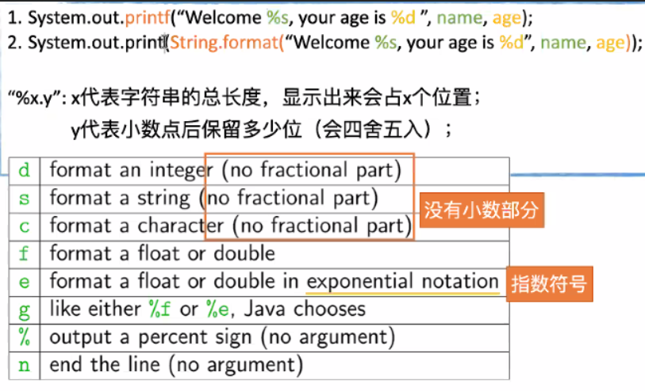

Example:

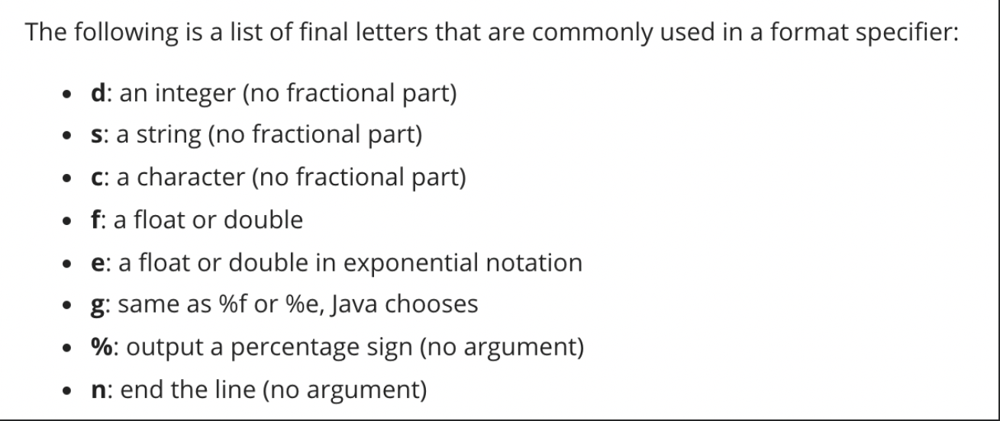

```java
public class FormatPlay {
    public static void main(String [] args) {
        String s = "string";
        double pi = 3.1415926535;
        System.out.printf("\"%s\" has %d characters %n", s, s.length()); 
        System.out.printf("pi to 4 places: %.4f%n", pi); 
        System.out.printf("Right>>%9.4f<<", pi);
        System.out.printf(" Left >>%-9.4f<<%n", pi);
        System.out.printf("$%.2f", 9.99);
    } 
}
```

```markdown
"string" has 6 characters 
pi to 4 places: 3.1416
Right>>   3.1416<< Left >>3.1416   <<
$9.99
```


### 命令行输入 - Command Line Input

When your program is run, you can pass it arguments through the command line. When you run the following in your console, *Hello.java* is an argument for the *javac* command:

当你的程序运行时，你可以通过命令行向它传递参数。当你在控制台中运行以下程序时，Hello.java是javac命令的一个参数。

```markdown
$ javac Hello.java
```


args用来hold the value

```java
public class HelloStranger {
    public static void main(String[] args) {
        System.out.println("Hello " + args[0] + "!");
    }
}
```


### 用console来赋值

```java
$ java HelloStranger Java // 最后这个Java是赋值
Hello Java!
```

### console 的 赋值变为 int？

```java
int argument = Integer.parseInt(args[0]);
```


````{admonition} Quiz1: 加法由console直接赋值

```java
//Create a program (Sum.java) that takes two numbers as input, adds them, and returns the result to the console.

public class Sum {
    public static void main(String[] args) {
        //TODO: your code goes here
        int x = Integer.parseInt(args[0]);
        int y = Integer.parseInt(args[1]);
        System.out.println(x+y);
    }
}
```
````

### 交互性质的console输入

Interactive programs allow users to provide input while they are running. To read in user input from the console, Java provides the *Scanner* class. To use it, you will need to import the class by adding the following line to the top of your program code.

交互式程序允许用户在程序运行时提供输入。为了从控制台读入用户输入，Java提供了*Scanner*类。要使用它，你需要在程序代码的顶部添加以下一行来导入该类。

```java
import java.util.Scanner;
//You need to create a Scanner object that is linked to your program's input stream:
Scanner keyboard = new Scanner(System.in);

//Now we can use the keyboard object to read input from the command line as follows:
String line = keyboard.nextLine();
```

```{margin} Output:
//output:
//Please enter your name: quechen yang
//Hello quechen yang!
```

````{admonition} Example

```java
import java.util.Scanner;

public class ScannerPlay {
    public static void main(String[] args) {
        Scanner keyboard = new Scanner(System.in);
        System.out.print("Please enter your name: ");
        String name = keyboard.nextLine();
        System.out.println("Hello " + name + "!");
    }
}
```
````


##  读取用户输入 - Scanner 

```java
1. import java.util.Scanner; // 导入java library 包
2. Scanner keyboard = new Scanner（System.in); // 创建Scanner object 赋值给变量keybaord
3. String inputContent = keyboard.nextLine(); // newLine获取键盘输入
```


```markdown
You can use the following Scanner methods to read in particular chunks or variable types:
你可以使用以下扫描器方法来读取特定的块或变量类型。

keyboard.nextLine(): reads the entire line, including the newline character
keyboard.nextLine(): 读取整个行，包括换行符

keyboard.next(): reads in one word as a String
keyboard.next()：读入一个单词，作为一个字符串。


keyboard.nextInt(): reads in a number and converts it to int
keyboard.nextInt(): 读取一个数字并将其转换为int


keyboard.nextDouble(): reads in a number and converts it to double
keyboard.nextDouble(): 读入一个数字并将其转换为双数


The above methods skip over any whitespace (spaces, tabs, and newlines) and read one 'word' at a time. You will notice an error is thrown if the user input does not match the expected type. 
上述方法跳过任何空白处（空格、制表符和换行符），一次读一个 "字"。你会注意到，如果用户的输入与预期的类型不一致，就会出现错误。

```


````{admonition} Quiz2: 交互性赋值加法

```java
//Just like before, create a program (InteractiveSum.java) that specifically asks the user for two numbers, adds them, and returns the result to the console.

// add your import statement here
import java.util.Scanner;


public class InteractiveSum {
    public static void main(String[] args) {
        //TODO: your code goes here
        Scanner keyboard = new Scanner(System.in);
        System.out.println("Please enter the first number:");
      // println: 就是自动在末尾换行
        int x = keyboard.nextInt();
        System.out.print("Please enter the second number:\n");
        int y = keyboard.nextInt();
        int z = x + y;
        System.out.print("The sum of " + x + " and " + y +" is " + z + "\n");
    }
}
```
````


## 输出 - Sout

Printing to the terminal is rather simple - all we have to do is to call the **println()** method on the **System.out object** that the Java framework provides to us, to do so.

向终端打印是相当简单的--我们所要做的就是调用Java框架提供给我们的System.out对象上的println()方法，来实现这一目的。

**Methods** are "actions" you can call on objects, to ask the objects to perform certain actions.

方法是你可以在对象上调用的 "行动"，以要求对象执行某些行动。

Calling the **println()** method, tells the **System.out** object to print a string to the terminal, ending with a **newline** character (the "return" character).

调用println()方法，告诉System.out对象向终端打印一个字符串，以换行符（即 "返回 "字符）结束。

```{margin} Output:
// output:
// Hi!
// I'm your Java program talking!
// How are you?
```

```java
// Calling the println() method, tells the System.out object to print a string to the terminal, ending with a newline character (the "return" character). println在最后会给换行符

public class MyProgram {

	public static void main(String[] args) {
		System.out.println("Hi!");
        System.out.println("I'm your Java program talking!");
        System.out.println("How are you?");
	}

}

```


###  Java的计算

```java
public class MyProgram {

	public static void main(String[] args) {

		System.out.println(2 * 10);   // 20
        System.out.println(100 / 4);  // 25
        System.out.println(1 + 2);    // 3
        System.out.println(2 - 1);    // 1
        System.out.println(-1000);    // -1000

	}

}
```


Note that by Java convention, a single white space should be placed between operators and the operands they work on. Operators that take a single operand are the exception.

请注意，根据Java的惯例，在操作符和它们所操作的操作数之间应该有一个空白。只取一个操作数的操作符是例外。

Operators in Java have an order of precedence. For example, multiplication and division has precedence over addition and subtraction. Brackets can also be used to group expressions together, to clearly define which operands should belong to which operators.

Java中的操作数有一个优先顺序。例如，乘法和除法比加法和减法有优先权。括号也可以用来将表达式组合在一起，以明确定义哪些操作数应属于哪些运算符。


### 使用变量

```{margin} Output:
//output:
//The average of the numbers are: 6.666666666666667
```
```java
public class MyProgram {

	public static void main(String[] args) {

        // The numbers we are working with.
        int firstNumber = 4;
        int secondNumber = 6;
        int thirdNumber = 10;

        // The count of the numbers.
        double count = 3;

        // Calculate the total of the numbers.
        int total = firstNumber + secondNumber + thirdNumber;

        double average = total / count;

        System.out.print("The average of the numbers are: ");
		System.out.println(average);

	}

}

```


Note that variables have a **type** and this must be declared when the variable is first defined.

请注意，变量有一个类型，这个类型必须在**第一次定义变量时声明。**

Integers **(int)** hold whole numbers, while doubles **(double)** and floats **(float)** hold decimal numbers. Strings **(String)** hold text.

整数（int）表示整数，而双数（double）和浮点数（float）表示小数。字符串（String）存放文本。


### 整数除法

One thing worth noting about division in Java (and some other programming languages), is that when dividing integers, Java will also try to return an integer.

关于Java（和其他一些编程语言）中的除法，有一点值得注意的是，当除以整数时，Java也会尝试返回一个整数。

This means that if a division of two numbers should result in a decimal part, it will simply drop the decimal part.

这意味着，如果两个数字的除法应该产生一个小数部分，它将简单地删除小数部分。


```{margin} Output:
//output:
//1
```
```java
public class MyProgram {

	public static void main(String[] args) {

        // This will print 1 due to integer division!
		System.out.println(3 / 2);

	}

}
```


```{margin} Output:
//output:
//1.5
```
```
public class MyProgram {

	public static void main(String[] args) {

        // This will print 1.5 since we are no longer doing integer
        // division - we are dividing an integer by a double, which
        // will result in a double.
		System.out.println(3 / 2.0);

	}

}

```


Penelope has being picking up seashells and fruit all day, and is planning to go to her local store to sell her items.

佩内洛普整天都在捡拾贝壳和水果，并打算去当地商店卖掉她的东西。

Fruit sells for $2.50 each, and seashells $0.60 each. 

水果的售价为每个2.5美元，贝壳的售价为每个0.6美元。

Write a program which asks Penelope for the number of fruit and seashells she has, and calculates the total price that she can sell her items for.

编写一个程序，要求佩内洛普提供她所拥有的水果和贝壳的数量，并计算出她可以卖出的总价格。

Your program should print the first input prompt, wait for the user to enter the input, before printing the second input prompt.

你的程序应该打印第一个输入提示，等待用户输入，然后再打印第二个输入提示。

```java
import java.util.Scanner;

public class SellingItems {

    public static void main(String[] args) {
            
        // TODO: Write your code for solving the problem here.
        System.out.println("Hello Penelope!");
        Scanner keyboard = new Scanner(System.in);
        System.out.print("How many fruit do you have to sell? ");
        int x = keyboard.nextInt();
        System.out.print("How many seashells do you have to sell? ");
        int y = keyboard.nextInt();
        System.out.println("You can sell those items for $" + (2.5*x+0.6*y) + "!");


    }

}
```


## Flow control

Flow control is one of the most essential elements in programming. It provides you with tools to dynamically respond to the data and inputs your program operates on. Flow control in Java includes concepts, such as branching and looping statements. Because most branching and looping statements are controlled by Boolean expressions, we will also discuss the Java type *boolean* in more detail.

流程控制是编程中最重要的元素之一。它为你提供了动态响应你的程序所操作的数据和输入的工具。Java中的流程控制包括一些概念，如分支和循环语句。因为大多数分支和循环语句是由布尔表达式控制的，所以我们还将更详细地讨论Java的布尔类型。

In this unit, you will learn about:

在本单元中，你将学习到以下内容。

1. branching mechanisms

   分支机制

2. loops, and

   循环，以及

3. debugging.

   调试。
   
   

###  Branching

- if-else,
- if, 
- and switch statements 

Most branching statements are controlled by Boolean expressions. A Boolean expression evaluates to either *true* or *false*. The primitive type *boolean* only takes the values *true* or *false*.

大多数分支语句是由布尔表达式控制的。布尔表达式评估为真或假。原始类型布尔只取值为真或假。

#### if-else

An if-else statement chooses between two alternative statements based on the value of a Boolean expression.

一个if-else语句根据一个布尔表达式的值在两个备选语句之间进行选择。


In Java, boolean expressions must be enclosed in parentheses. If the boolean expression evaluates to *true,* the Yes_Statement is executed. If it evaluates to *false,* the No_Statement is executed.  Each Yes_Statement and No_Statement branch of an if-else can be made up of a single or many statements. A branch that is made up of a list of statements is called a **compound statement**.

在Java中，布尔表达式必须用圆括号括起来。如果布尔表达式的值为*true，*就执行Yes_Statement。如果它的值为*false，*则执行No_Statement。 if-else的每个Yes_Statement和No_Statement分支可以由单个或多个语句组成。一个由一系列语句组成的分支被称为**复合语句。


```java
// A compound statement must always be enclosed in a pair of braces ({ }). If it's just a single statement you can omit the pair of braces. It is, however, good coding practice to always include them.
// 一个复合语句必须始终用一对大括号（{ }）括起来。如果它只是一个单一的语句，你可以省略这对大括号。然而，良好的编码实践是总是包括它们。

public class JavaLove {
    public static void main(String[] args) {
        
        boolean iLoveJava = true;
        int hoursSpentCodingJava = 10;

        if(iLoveJava) {
            System.out.println("Everyone loves Java!");
        } else {
            System.out.println("You will get there!");
        }

        if(hoursSpentCodingJava > 10000) {
            System.out.println("Java L33T!");
        } else
            System.out.println("Practice leads to mastery!");
    }
}
// Everyone loves Java!
// Practice leads to mastery!
```


#### Else 部分也可以不要

```java
// The else part of an if-else statement may be omitted to obtain what is often only called an if statement. If the Boolean_Expression is true, then the Action_Statement is executed. Otherwise, the Action_Statement is not executed and the program moves on to the next statement.
一个if-else语句的else部分可以省略，以获得通常只被称为if语句的东西。如果Boolean_Expression为真，那么Action_Statement被执行。否则，Action_Statement不被执行，程序将进入下一个语句。

public class Salary {
    public static void main(String[] args) {
        
        int numberOfSales = 101;
        int salary = 100000;
        int bonus = 10000;

        if(numberOfSales > 100) {
            salary += bonus;
            System.out.println("Congratulations! You received a bonus!");
        }

        System.out.println("Your salary this year: " + salary);

    }
}

// output:
// Congratulations! You received a bonus!
// Your salary this year: 110000
```


#### 嵌套语句 - Nested Statements

*if-else* and *if* statements can contain single or compound statements, including other *if-else* and *if* statements. In this case, we speak of **nested statements**. Each level of a nested *if-else* or *if* should be indented further than the previous level to make your code readable:

if-else和if语句可以包含单个或复合语句，包括其他if-else和if语句。在这种情况下，我们说的是嵌套语句。嵌套的if-else或if的每一层都应该比上一层缩进，以使你的代码可读。

```java
public class Tax {
    public static void main(String[] args) {
        
        int income = 30000;
        int numberOfKids = 2;
        double tax = 0;

        if(income > 18201) {
            tax = income * 0.19;
            
            if(numberOfKids>0) {
                tax = tax - 500; //tax relief
            }
        }

        System.out.printf("You owe $%.2f in taxes.", tax);

    }
}

// output
// You owe $5200.00 in taxes.
```


#### 更复杂的if-else - Multiway if-else

The multiway if-else statement is simply a normal *if-else* statement that nests another *if-else* statement at every *else* branch. The Boolean_Expressions are evaluated in the order they are written until one evaluates to *true*. The final *else* is optional.

多路if-else语句只是一个普通的*if-else*语句，在每个*else*分支处嵌套另一个*if-else*语句。Boolean_Expressions按照它们的书写顺序被评估，直到其中一个评估为*true*。最后的*else*是可选的。


```java
public class Salary {
    public static void main(String[] args) {
        
        int numberOfSales = 75;
        int salary = 100000;
        int smallBonus = 2000;
        int mediumBonus = 5000;
        int bigFatBonus = 10000;

        if(numberOfSales > 200) {
            salary += bigFatBonus;
        } else if(numberOfSales > 100) {
            salary += mediumBonus;
        } else if(numberOfSales > 50) {
            salary += smallBonus;
        } else {
            System.out.println("No bonus this year. :(");
        }

        System.out.println("Your salary this year: " + salary);

    }
}
```


------

### Switch

```java
//The switch statement is the only other kind of Java statement that implements multiway branching. When a switch statement is evaluated, one of a number of different branches is executed. The choice of which branch to execute is determined by a controlling expression enclosed in parentheses after the keyword switch.

//switch语句是唯一一种实现多路分支的Java语句。当switch语句被评估时，一些不同的分支被执行。选择执行哪个分支是由关键字switch后面括号中的控制表达式决定的。

switch (Controlling_Expression)
{
  case Case_Label_1:
           Statement_Sequence_1
           break;
  case Case_Label_2:
           Statement_Sequence_2
           break;
  case Case_Label_n:
           Statement_Sequence_n
           break;
  default:
}
```

**<u>*Beware that the controlling expression must evaluate to a char, int, short, byte or String.*</u>**

switch语句中的每个分支语句都以保留词case开始，后面是一个叫做case标签的常量，再后面是冒号，然后是一连串的语句。每个case标签必须与控制表达式的类型相同。案例标签不需要按顺序列出，也不需要跨越一个完整的区间，但每个标签只能出现一次。

可选的默认标签通常最后使用。如果没有匹配的案例标签，那么执行的唯一语句就是默认标签之后的语句（如果有的话）。即使case标签涵盖了某个switch语句中所有可能的结果，包含一个默认部分仍然是一个好的做法。在这种情况下，例如，它可以用来输出一个错误信息。

每个语句序列后面都可以有一个break语句，它告诉程序执行在switch块之后继续。**如果你不添加break语句**，**下一个case标签将被评估。**switch语句在执行break语句时或达到switch语句的末端时结束。

!!!! 而且没加break不会提示错误 !!!!

```java
import java.util.Scanner;

public class DayOfWeek {

	public static void main (String[] args) {
		
		Scanner keyboard = new Scanner(System.in);

        System.out.println("Enter day of the week:");
        int dayOfWeek = keyboard.nextInt();

        switch (dayOfWeek) {
            case 1:
                System.out.println("Today is Monday");
                break;

            case 2:
                System.out.println("Today is Tuesday");
                break;

            case 3:
                System.out.println("Today is Wednesday");
                break;
            case 4:
                System.out.println("Today is Thursday");
                break;
            case 5:
                System.out.println("Today is Friday");
                break; //see what happens if you remove this break statement
            default:
                System.out.println("This is not a work day");
                break;
        }	
	}
}
```


------

## 条件操作符 - The Conditional Operator

The **conditional operator** is a notational variant on certain forms of the *if-else* statement. It is also referred to as the **ternary operator** or **arithmetic if**:

条件运算符是某些形式的if-else语句的符号化变体。它也被称为三元运算符或算术if。

```java
if(n1>n2) 
    max = n1; 
else 
    max = n2;
```

三元运算符实例

```java
max = (n1 > n2) ? n1 : n2; 
```

The expression to the right of the assignment operator is a **conditional operator expression**. 

If the Boolean expression is *true*, the expression evaluates to the value of the first expression (n1).

 Otherwise, it evaluates to the value of the second expression (n2).

赋值运算符右边的表达式是一个条件运算符表达式。

如果布尔表达式为真，该表达式评估为第一个表达式的值（n1）。

否则，它将被评估为第二个表达式的值（n2）


------

##  循环 - Loops

- while
- do-while, 
- and for statements 

The code that is repeated in a loop is called the **body** of the loop. Each repetition of the loop body is called an **iteration** of the loop.

循环中重复的代码被称为循环的主体。循环主体的每一次重复都被称为循环的一次迭代。


### while

A *while* statement is used to repeat a portion of code (*i.e.*, the loop body) based on the evaluation of a Boolean expression. This Boolean expression is checked *before* the loop body is executed. If the expression evaluates to *false*, the loop body is not executed at all. Before the execution of each following iteration of the loop body, the Boolean expression is checked again. If it still evaluates to *true*, the loop is executed again. If it evaluates to *false*, the loop statement ends.

while语句用于根据布尔表达式的评估来重复一部分代码（即循环体）。在执行循环体之前，这个布尔表达式被检查。如果该表达式的值为false，则循环体根本不被执行。在执行循环体的每个后续迭代之前，布尔表达式被再次检查。如果它的评估值仍然为真，那么循环将再次被执行。如果它的值为false，则循环语句结束。


### while 的错误类型

Beware the dreaded **infinite** or **dead** **loop**, *i.e.,* a loop that is executed indefinitely as the Boolean expression never evaluates to *false*. A loop should be designed so that the value tested in the Boolean expression is changed in a way that eventually makes it false, and terminates the loop.

小心可怕的**无限**或**死**的*循环，*即*个无限期执行的循环，因为布尔表达式永远不会被评估为*false*。循环应该被设计成在布尔表达式中测试的值被改变，最终使其变成假的，并终止循环。

Another common loop error is the *off-by-one* error, *i.e.,* when a loop repeats the loop body one too many or one too few times.

另一个常见的循环错误是*off-by-one*错误，*也就是说，*当一个循环重复循环体的次数过多或过少时。


```java
public class WhileDemo {
    public static void main (String[] args) {

       int count = 10;

       while(count>0) {
           System.out.println(count);
           count--; 
       }
    }
}

//output
//10
9
8
7
6
5
4
3
2
1
```


### Do-while

A *do-while* statement is used to execute a portion of code (*i.e.*, the loop body), and then repeat it based on the evaluation of a Boolean expression. Hence, the loop body is executed at least once.

Do-while语句用于执行一部分代码（即循环体），然后根据布尔表达式的评估来重复执行。因此，循环体至少被执行一次。

The Boolean expression is checked after each iteration of the loop body. The loop terminates as soon as the expression evaluates to *false.* 

布尔表达式在循环体的每次迭代后被检查。一旦表达式的值为假，循环就会终止。

```java
public class DoWhileDemo {
    public static void main (String[] args) {

       int count = 10;

       do {
           System.out.println(count);
           count--; 
       } while(count>0);
    }
}

// output 打印10 - 1
```

**<u>*!!!Don't forget to put a semicolon after the Boolean expression.!!!*</u>** 


------

## For 循环

The *for* statement is most commonly used to step through an integer variable in equal increments. 

for语句最常用于以等量递增的方式遍历一个整数变量。

It begins with the keyword *for* followed by three expressions in parentheses that describe what to do with one or more controlling variables:

它以关键字for开始，后面是三个括号内的表达式，描述对一个或多个控制变量的处理。


**<u>长啥样？- 注意这三个控制表达式是由两个而不是三个分号隔开的。在循环开始的闭合小括号后没有分号。</u>**

```java
for(Initializing; Boolean_Expression; Update)
    Body
```


The first expression (*Initializing*) tells how the control variable or variables are initialized or declared and initialized before the first iteration The second expression (*Boolean_Expression*) determines when the loop should end, based on the evaluation of a Boolean expression before each iteration. The third expression (*Update*) tells how the control variable or variables are updated after each iteration of the loop body.

第一个表达式（Initializing）讲述了如何在第一次迭代前初始化控制变量或声明和初始化控制变量。

第二个表达式（Boolean_Expression）**根据每次迭代前对一个布尔表达式的评估，决定循环何时结束。**

第三个表达式（Update）讲述了在循环体的每次迭代后**如何更新控制变量或变量。**

The *Body* may consist of a single statement or a list of statements enclosed in a pair of braces { }. 

循环体可以由一个单一的语句或一个包含在一对大括号{ }中的语句列表组成。

```java
public class BottleCount {
    public static void main(String[] args) {
        for(int i=10; i>0; i--) {
            System.out.printf("%d beer bottles left in the fridge.\n", i);
        }
    }
}
```

Output:

```markdown
10 beer bottles left in the fridge.
9 beer bottles left in the fridge.
8 beer bottles left in the fridge.
7 beer bottles left in the fridge.
6 beer bottles left in the fridge.
5 beer bottles left in the fridge.
4 beer bottles left in the fridge.
3 beer bottles left in the fridge.
2 beer bottles left in the fridge.
1 beer bottles left in the fridge.
```


Caution must be used when combining a declaration with multiple actions. It is, for example, illegal to combine multiple type declarations with multiple actions, for example. To avoid possible problems, it is best to declare all variables outside the for statement.

当把一个声明与多个动作结合起来时，必须谨慎行事。例如，将多个类型声明与多个动作相结合是非法的。为了避免可能出现的问题，最好是在for语句之外声明所有的变量。

A *for* loop can contain multiple update actions, separated by commas:

一个*for*循环可以包含多个更新动作，用逗号分隔。

```java
for(int i=0, j=100; i<j; i++, j--) {}
```

However, a for loop can contain only one Boolean expression to test for ending the loop.

然而，一个for循环只能包含一个布尔表达式来测试结束循环。


### Nested for 循环

```java
public class Matrix {
    public static void main(String[] args) {
        for(int row=1; row<4; row++) {
            for(int col=1; col<5; col++) {
                System.out.printf("%d/%d \t", row, col);
            }
            System.out.print("\n");
        }
    }
}
```

output:

```markdown
1/1 1/2 1/3 1/4 
2/1 2/2 2/3 2/4 
3/1 3/2 3/3 3/4
```


### Break & Continue

The **break statement** consists of the keyword *break* followed by a semicolon. It ends the nearest enclosing *switch* or *loop* statement.

break语句由关键字break和分号组成。它结束最近的开关或循环语句。

```java
import java.util.Random;
public class RandomNumberGenerator {
    public static void main(String[] args) {
        Random rand = new Random();
        int upperbound = 10;
        int count = 0;
        while(true) {
            int randomNumber = rand.nextInt(upperbound); 
            System.out.println("random number generated: " + randomNumber);
            count += 1;
            if(randomNumber > 6) {
                break;
            }
        }
        System.out.printf("%d numbers generated", count);
    }
}
```


The **continue statement** consists of the keyword *continue* followed by a semicolon. When executed, the continue statement ends the current loop body iteration of the nearest enclosing loop statement. 

continue语句由关键字continue和一个分号组成。当执行时，continue语句结束当前循环体的迭代，最近的包围循环语句。

```java
import java.util.Random;
public class CrackingMyOwnNumber {
    public static void main(String[] args) {
        Random rand = new Random();
        int upperbound = 10;
        int randomNumber = rand.nextInt(upperbound); 
        
        while(upperbound>0) {
            System.out.println("+ I think your number is " + upperbound);
            if(upperbound!=randomNumber) {
                System.out.println("- nope");
                upperbound--;
                continue;
            }
            System.out.println("- you got it!");
            break;
        }
    }
}
```

```markdown
+ I think your number is 10
- nope
+ I think your number is 9
- nope
+ I think your number is 8
- nope
+ I think your number is 7
- nope
+ I think your number is 6
- nope
+ I think your number is 5
- nope
+ I think your number is 4
```


When loop statements are nested, any *break* or *continue* statement applies to the innermost, containing loop statement.

当循环语句被嵌套时，任何*break*或*continue*语句都适用于最里面的、包含循环语句。

In a *for* loop, the continue statement transfers control to the update expression.

在一个*for*循环中，继续语句将控制权转移到更新表达式。


There is a type of *break* statement that, when used in nested loops, can end any containing loop, not just the innermost loop. To achieve this, we use a **labeled break statement**. If an enclosing loop statement is labelled with an Identifier, the following version of the break statement will exit the labelled loop, even if it is not the innermost enclosing loop: 

有一种类型的break语句，在嵌套循环中使用时，可以结束任何包含的循环，而不仅仅是最内层的循环。为了实现这一点，我们使用一个**<u>标记的中断语句</u>**。如果一个封闭的循环语句被标注了一个标识符，那么下面的断裂语句将退出被标注的循环，即使它不是最内层的封闭循环。（结束全部）

break someIdentifier; 

以下这个例子就把outerLoop作为了一种identifier

```java
public class LabelledBreak {
    public static void main(String[] args) {

        int i=7;

        outerLoop:
        while(i<20) {	
            for(int j=1; j<i; j++) {
                System.out.print("*");
            
                if(i==10)
                    break outerLoop;

                System.out.print("\n"); 
                i++;
            }
        }

        System.out.println("\nEnough looping!");
    }
}
```


## Exit - 程序退出

A *break* statement will end a loop or *switch* statement, but will not end the program. The *exit* statement will immediately end the program as soon as it is invoked: 

break语句将结束一个循环或开关语句，但不会结束程序。exit语句一经调用就会立即结束程序。

```markdown
System.exit(0);
```

The exit statement takes one integer argument . By tradition, a zero argument is used to indicate a normal ending of the program. However, the cleanest way to end a program is to always let it run to the end of its *main* function.

exit语句需要一个整数参数。按照传统，一个零参数用来表示程序的正常结束。然而，结束程序的最干净的方法是始终让它运行到其主函数的末端。


------

## Debugging

A  *bug* is an error or flaw in a program that leads to incorrect or unexpected program execution. The process of finding and fixing bugs is termed **debugging**. Regardless of whether you are hunting down bugs or are trying to understand how exactly your program is executed, the following techniques will help you look under your code's hood.

BUG是程序中的一个错误或缺陷，导致不正确或意外的程序执行。寻找和修复错误的过程被称为**调试**。无论你是在寻找错误，还是试图了解你的程序到底是如何执行的，以下技术将帮助你查看你的代码的罩子。


### 跟踪变量 - Tracing Variables

**Tracing variables** involves watching one or more variables change value while a program is running. This can make it easier to discover errors in a program and debug them. Many Integrated Development Environments (IDEs) have a built-in utility that allows variables to be traced without making any changes to the program. 

追踪变量包括在程序运行时观察一个或多个变量的数值变化。这可以使我们更容易发现程序中的错误并对其进行调试。许多集成开发环境（IDE）有一个内置的工具，可以在不对程序进行任何修改的情况下追踪变量。

```java
//手动跟踪
//tracing the variable count
System.out.println("count=" + count); 
```


### 使用断言 - Using Assertions

An **assertion** is a sentence that says (asserts) something about the state of a program. An assertion must be either *true* or *false*, and should be *true* if a program is working properly. Assertions can be placed in a program as comments:

一个**断言**是一个说（断言）关于程序状态的句子。一个断言必须是*真*或*假*，如果程序工作正常，它应该是*真*。断言可以作为注释放在程序中。

```java
// 打开断言
$ java -enableassertions DrinkOrder
  
// 使用断言
assert Boolean_Expression;
```

````{admonition} Quiz3 - Sum of Numbers

Write a for loop that calculates the sum of the numbers from one to a hundred. 

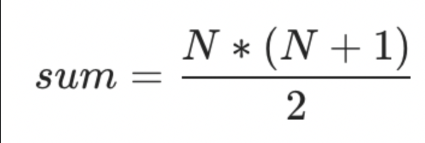

```java
public class SumOfNumbers {
    public static void main(String[] args) {
        int n = 100;
        int sum = 100*(100+1)/2;
        assert sum == 5050;
        System.out.println(sum);
        //TODO: your code goes here

    }
}
```
````


````{admonition} Quiz4 - Pyramids

Write a program that prints out a pyramid of stars using command-line arguments and a nested for-loop.

```markdown
$ java Pyramid 5 left
```

The program execution above should lead to the following result:

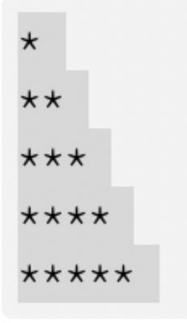

This pyramid is *left*-aligned as indicated by the second command-line argument. 

```markdown
$ java Pyramid 3 right
```

The program execution above should lead to the following, *right-*aligned result:


```java
public class Pyramid {
    public static void main(String[] args) {
        // Your code goes here
        int h = Integer.parseInt(args[0]);
        String x = args[1];
        // Test args
        //System.out.println(x);

        if(x.equals("left")){
            // Test if
            //System.out.println("Yes");
            for(int row = 0; row <  h; row++){
                System.out.print("*");
                for(int col = 0 ; col< row; col++){
                  // 这里的col要和row联系起来，内圈loop和外圈loop要有关系而不是各自单独运行 
                    System.out.print("*");
                }
                System.out.println();
            }
        } else {
            for(int row = 0; row <  h; row++){
                for (int uuu = 0; uuu < h-1-row; uuu++){
                    System.out.print(' ');
                }
                System.out.print("*");
                for(int col = 0 ; col< row; col++){
                    System.out.print("*");
                }
                System.out.println();            
        }
    }
}}
```
````


````{admonition} Quiz5 - 机器人

When the user enters "**hello"**, the robot should ask for the user's name. The user should then enter a name, and this name should be remembered and repeated back by Robot, and the program should end.

```markdown
> hello
Hello, my name is Robot, what is your name?
> John
That's a lovely name John. I hope I see you again.
```

If the user enters "**bye"**, then Robot will also say good bye and the program should end. 

```markdown
> bye
Good bye, stranger.
```


```
import java.util.Scanner;

public class HelloRobot {

	public static void main(String[] args) {

		// TODO: Write your code for solving the problem here.
		//Create the scanner object we can use it read input from out keyboard
		Scanner scanner = new Scanner(System.in);

		//print out the terminal prompt
		String command = scanner.NextLine();

		//Handle the different commands the user could enter
		if (command.equals("hello")){
			//Ask the user their name
			System.out.println("Hello, my name is Robot, what is your name?");
			System.out.print(">");
			String userName = scanner.nextLine();

			System.out.println("That is lovely name, " + userName + ". I hope I see you again.");

		} else if (command.equals("bye")){
			//say good bye 
			System.out.println("goodbye, sir");
		} else {
			System.out.println("I didn't understand");
		}
		// close
		scanner.close();
	}

}
```
````


````{admonition} Quiz6 - 计算器

 Part I

Write a simple calculator tool that can perform different calculations based on the command line arguments provided to it.

编写一个简单的计算器工具，可以根据提供给它的命令行参数执行不同的计算。

The **first argument** should be an **operator** representing an operation that you would like to perform (such as **+** for addition), and the **second and third arguments** should be the **operands** to the operator.

第一个参数应该是一个代表你想执行的操作的运算符（如+表示加法），第二和第三个参数应该是运算符的操作数。

```java
public class SimpleCalculator {
	//Constants
	private static final String ADD = "+";
	private static final String SUB = "-";
	private static final String MUL = "*";
	private static final String DIV = "/";
	private static final String IDIV = "//";

	public static void main(String[] args) {

		// TODO: Write your code for solving the problem here.
		if (args.length !=3){
			System.out.println("Need 3 command line args.");
			System.exit(0); // quit program -- indicates failure
		}
		String operator = args[0];
		double leftOperand = Double.parseDouble(args[1]);
		double rightOperand = Double.parseDouble(args[2]);

		switch(operator){
			case ADD:
				Ststem.out.println(leftOperand + rightOperand);
				break;
			case SUB:
				Ststem.out.println(leftOperand - rightOperand);
				break;
			case MUL:
				Ststem.out.println(leftOperand * rightOperand);
				break;
			case DIV:
				Ststem.out.println(leftOperand / rightOperand);
				break;

		}
	}
	
}
```

------

Part II

Expand on the features of your calculator tool, so that it can do more complicated calculations, such as calculating the volume and area of a circle.

扩展你的计算器工具的功能，使其能够进行更复杂的计算，如计算一个圆的体积和面积。

The **first argument** should be the **shape** we want to perform a calculations for, the **second argument** should be the **calculation** we want to perform, and the **third argument** should be a **value** we want to provide for the calculation.

第一个参数应该是我们要进行计算的形状，第二个参数应该是我们要进行的计算，第三个参数应该是我们要为计算提供的值。
````


------

##  Worksheet for Flow Control

IF - ELSE - IF

```JAVA
public class MyProgram {

	public static void main(String[] args) {

        int age = 17;

        System.out.println("Your age is " + age + "...");
        if(age >= 18) {
            System.out.println("You are old enough to enter the bar!");
        } else if(age >= 16) {
            System.out.println("You're almost old enough to enter the bar, but not quite yet. Come back in a few years!");
        } else if(age < 5) {
            System.out.println("You're way too young!!");
        } else {
            System.out.println("Sorry, you're too young to enter the bar!");
        }

	}

}
```

FOR

```JAVA
public class MyProgram {

	public static void main(String[] args) {

        int numberOfTimesToLoop = 6;

        for(int i=0; i<numberOfTimesToLoop; i++) {
            System.out.println("Looping... " + i);
        }

	}

}
```

```java
Looping... 0
Looping... 1
Looping... 2
Looping... 3
Looping... 4
Looping... 5
```

In the code above:

- The **initializer expression** was **i=0**. We set this variable so we can use it to control the termination of the loop.

  初始化表达式是i=0。我们设置了这个变量，所以我们可以用它来控制循环的终止。

- The **running condition** was **i<numberOfTimesToLoop** - ie the loop keeps running until the expression becomes false.

  运行条件是i<numberOfTimesToLoop--即循环一直运行到表达式变为false。

- The **increment expression** was **i++**, and is what gets run at the end of each iteration of the loop. Here, we **add 1** to the looping variable each loop, to bring the running condition closer to becoming false each time.

  增量表达式是i++，是在循环的每个迭代结束时被运行的内容。在这里，我们在每次循环中都给循环变量加1，以使运行条件每次都更接近于变成假。

Note that with each iteration of a loop, we want to bring it close to reaching the condition in which the running condition will become false, so that out loop will eventually terminate. If we do not do this, our loop would run infinitely, and is what is known as an **infinite loop**. (Try changing the increment expression in the code above from **i++** to **i--** and see what happens).

请注意，在循环的每一次迭代中，我们要使它接近于达到运行条件为假的条件，这样，循环就会最终终止。如果我们不这样做，我们的循环就会无限地运行，这就是所谓的无限循环。(试着把上面的代码中的增量表达式从i++改为i--，看看会发生什么）。)

WHILE

```JAVA
import java.util.Random;

public class MyProgram {

	public static void main(String[] args) {

        int facesOnDie = 20;
        int targetNumber = 20;

        Random random = new Random();
        int randomNum = 0;

        System.out.println("Give me a " + targetNumber + "!");
        System.out.println();

        while (randomNum != targetNumber) {
            // Generate a random number between 1 and 6.
            randomNum = random.nextInt(facesOnDie) + 1;
            System.out.println("Rolled a " + randomNum);
        }

        System.out.println();
        System.out.println("Yes! I rolled a " + targetNumber + "!");
        System.out.println();

	}

}
```

```java
Rolled a 15
Rolled a 11
Rolled a 3
Rolled a 2
Rolled a 16
Rolled a 4
Rolled a 20

Yes! I rolled a 20!
```


````{admonition} Quiz7 - 打印乘法表

The program should print the multiplication table from 1 to 10 for that number.

```java
Please enter a number: 3
1 x 3 = 3
2 x 3 = 6
3 x 3 = 9
4 x 3 = 12
5 x 3 = 15
6 x 3 = 18
7 x 3 = 21
8 x 3 = 24
9 x 3 = 27
10 x 3 = 30
```

```java
import java.util.Scanner;
public class MultiplicationTableGenerator {
	
	public static void main(String[] args) {
        
		// TODO: Write your code for solving the problem here.
		Scanner keyboard = new Scanner(System.in);
		System.out.print("Please enter a number: ");
		int x = keyboard.nextInt();

		for(int i=1; i<11; i++){
			System.out.print(i);
			System.out.print(" x ");
			System.out.print(x);
			System.out.print(" = ");
			int y = i * x;
			System.out.println(y);
		}
	}
	
}
```
````

````{admonition} Quiz7 - 2 - Mars Rover

- **mapWidth** is the number of cells wide the map is
- **mapHeight** is the number of cells high the map is
- **startX** is the cell number the rover starts in, from the left
- **startY** is the cell number the rover starts in, from the top
- **targetX** is the cell number the rover wants to arrive at, from the left
- **targetY** is the cell number the rover wants to arrive at, from the top

All arguments should be integers, and cell numbers start from 0.

For example, the following call:

java Rover 5 3 0 0 4 2

... should generate the following graphical representation, with the rover being displayed in the top left of the map, and the target location being displayed in the bottom right of the map:

```java
M....
.....
....X
```


```java
public class Rover {

	// Some constants for accessing command line argument indexes.
	final static int MAP_WIDTH_INDEX = 0;
	final static int MAP_HEIGHT_INDEX = 1;
	final static int MAP_START_X_INDEX = 2;
	final static int MAP_START_Y_INDEX = 3;
	final static int MAP_TARGET_X_INDEX = 4;
	final static int MAP_TARGET_Y_INDEX = 5;
	
	// Some constants used to render the map.
	final static String MAP_CELL_ROVER = "M";
	final static String MAP_CELL_TARGET = "X";
	final static String MAP_CELL_EMPTY = ".";
	
	public static void main(String[] args) {
		
		// Assign more meaningful names to the values from the command line,
		// while converting them to an appropriate data type.
		final int mapWidth = Integer.parseInt(args[MAP_WIDTH_INDEX]);
		final int mapHeight = Integer.parseInt(args[MAP_HEIGHT_INDEX]);
		final int startX = Integer.parseInt(args[MAP_START_X_INDEX]);
		final int startY = Integer.parseInt(args[MAP_START_Y_INDEX]);
		final int targetX = Integer.parseInt(args[MAP_TARGET_X_INDEX]);
		final int targetY = Integer.parseInt(args[MAP_TARGET_Y_INDEX]);
		
		// Variables for holding the current position of the rover,
		// Initialized to the starting location.
		int roverX = startX;
		int roverY = startY;
		
		// Draw the map, by drawing each row.
		for(int y=0; y < mapHeight; y++) {
			
			// Draw each cell in a row.
			for(int x=0; x < mapWidth; x++) {
				
				// Output the appropriate symbol for each cell.
				if(x == roverX && y == roverY) {
					// If rendering the rover location.
					System.out.print(MAP_CELL_ROVER);
					
				} else if(x == targetX && y == targetY) {
					// If rendering the target location.
					System.out.print(MAP_CELL_TARGET);
					
				} else {
					// If rendering an empty cell.
					System.out.print(MAP_CELL_EMPTY);
					
				}
				
			}
			
			// Create a newline at the end of each row. of the map we render.
			System.out.println();
		}
		
	}

}
```
````


````{admonition} Quiz7 - 3 - Mars Rover

Allow the user to control the movement of the rover by entering one of the following commands, representing the direction of movement based on a compass direction - **n for North, s for South, e for East, and w for West,** followed by a number to indicate the **number of cells** to move:

```java
n <numberOfCellsToMove>
s <numberOfCellsToMove>
e <numberOfCellsToMove>
w <numberOfCellsToMove>
```


After the rover has moved, an updated map should be displayed.

If the rover reaches the target destination, the program should terminate, indicating the **number of valid commands executed**, and the **total distance travelled (in meters)** to reach the destination.

```java
java Rover 5 3 0 0 4 2
M....
.....
....X

> e 2
..M..
.....
....X

> s 2
.....
.....
..M.X

> e 1
.....
.....
...MX

> e 1
Target reached after 4 commands, and a travel distance of 120.0 meters
```


**If an invalid movement command** is specified (ie a movement command that would move the rover out of bounds, according to the map), then the warning **"Invalid movement."** should be displayed, no movement should occur, and the map and prompt should be redisplayed again. For example:

```java
java Rover 5 3 0 0 4 2
M....
.....
....X

> n 1
Invalid movement.
M....
.....
....X

> 
```
````


HInt:

Consider using the **string** **split()** method to break up a single string into an array of strings - which will be of a similar form to the **args** argument from the main method, which we've used before. 

考虑使用字符串split()方法将单个字符串分解成一个字符串数组--其形式将与我们之前使用的main方法的args参数相似。

```java
String[] commandArgs = command.split(" ");
```

Assuming that the **command** variable holds a string with spaces in it, **command.split(" ")** will break that string up into parts, based on the space character.

假设command变量持有一个含有空格的字符串，command.split(" ")将根据空格字符将该字符串分割成若干部分。


**If an invalid command is issued** (ie because the command is not one of n, e, s, or w), then the warning  **"Invalid command."** should be displayed,  no movement should occur, and the map and prompt should be redisplayed again. For example:

```java
java Rover 5 3 0 0 4 2
M....
.....
....X

> ee 1
Invalid command.
M....
.....
....X

> 
```


 **Tip!**

This question has quite a few different parts, so try to break this task into smaller parts and then implement each part separately. 

For example, try implementing the movement without thinking about invalid movement for the time being. After basic movement is implemented, add the error checking. After error checking is implemented, implement the counting of commands and distance travelled.

The skill of decomposing a larger problem into smaller parts is an effective tool in Software Engineering, which you can start practicing and applying immediately to your benefit.

```java
import java.util.Scanner;

public class Rover {

	// Some constants for accessing command line argument indexes.
	final static int MAP_WIDTH_INDEX = 0;
	final static int MAP_HEIGHT_INDEX = 1;
	final static int MAP_START_X_INDEX = 2;
	final static int MAP_START_Y_INDEX = 3;
	final static int MAP_TARGET_X_INDEX = 4;
	final static int MAP_TARGET_Y_INDEX = 5;
	
	// Some constants used to render the map.
	final static String MAP_CELL_ROVER = "M";
	final static String MAP_CELL_TARGET = "X";
	final static String MAP_CELL_EMPTY = ".";
	
	// Constants for the movement commands.
	final static String MOVE_NORTH = "n";
	final static String MOVE_EAST = "e";
	final static String MOVE_SOUTH = "s";
	final static String MOVE_WEST = "w";
	
	
	final static double CELL_WIDTH = 20;
	final static double CELL_HEIGHT = 20;
	
	public static void main(String[] args) {
		
		// Assign more meaningful names to the values from the command line,
		// while converting them to an appropriate data type.
		final int mapWidth = Integer.parseInt(args[MAP_WIDTH_INDEX]);
		final int mapHeight = Integer.parseInt(args[MAP_HEIGHT_INDEX]);
		final int startX = Integer.parseInt(args[MAP_START_X_INDEX]);
		final int startY = Integer.parseInt(args[MAP_START_Y_INDEX]);
		final int targetX = Integer.parseInt(args[MAP_TARGET_X_INDEX]);
		final int targetY = Integer.parseInt(args[MAP_TARGET_Y_INDEX]);
		
		// Variables for holding the current position of the rover,
		// Initialized to the starting location.
		int roverX = startX;
		int roverY = startY;
		
		// Flag for indicating whether or not we've reached the target.
		boolean isTargetReached = false;
		
		// Scanner for reading in user input.
		Scanner scanner = new Scanner(System.in);
		
		// Variables for keeping track of movement statistics.
		double distanceTravelled = 0;
		int numValidCommands = 0;
		
		// Keep rendering the map, and asking for user input, when the target
		// has not been reached yet.
		while(!isTargetReached) {
			
			// Draw the map, by drawing each row.
			for(int y=0; y < mapHeight; y++) {
				
				// Draw each cell in a row.
				for(int x=0; x < mapWidth; x++) {
					
					// Output the appropriate symbol for each cell.
					if(x == roverX && y == roverY) {
						// If rendering the rover location.
						System.out.print(MAP_CELL_ROVER);
						
					} else if(x == targetX && y == targetY) {
						// If rendering the target location.
						System.out.print(MAP_CELL_TARGET);
						
					} else {
						// If rendering an empty cell.
						System.out.print(MAP_CELL_EMPTY);
						
					}
					
				}
				
				// Create a newline at the end of each row. of the map we render.
				System.out.println();
			}
			
			System.out.println();
			
			// Print a user prompt.
			System.out.print("> ");

			// Read in the user's input command.
			String command = scanner.nextLine();
			String[] commandArgs = command.split(" ");
			
			String moveDirection = commandArgs[0];
			int moveAmount = Integer.parseInt(commandArgs[1]);
			
			// Process the movement command.
			if(moveDirection.equalsIgnoreCase(MOVE_NORTH)) {
				
				// Check if movement is in bounds - if so move, otherwise show warning.
				if(roverY - moveAmount >= 0) {
					
					// Update movement.
					roverY -= moveAmount;
					
					// Update stats.
					numValidCommands++;
					distanceTravelled += moveAmount * CELL_HEIGHT;
					
				} else {
					System.out.println("Invalid movement.");
				}	
				
			} else if(moveDirection.equalsIgnoreCase(MOVE_EAST)) {
				
				// Check if movement is in bounds - if so move, otherwise show warning.
				if(roverX + moveAmount < mapWidth) {
					
					// Update movement.
					roverX += moveAmount;
					
					// Update stats.
					numValidCommands++;
					distanceTravelled += moveAmount * CELL_WIDTH;
					
				} else {
					System.out.println("Invalid movement.");
				}	
				
			} else if(moveDirection.equalsIgnoreCase(MOVE_SOUTH)) {

				// Check if movement is in bounds - if so move, otherwise show warning.
				if(roverY + moveAmount < mapHeight) {
					
					// Update movement.
					roverY += moveAmount;
					
					// Update stats.
					numValidCommands++;
					distanceTravelled += moveAmount * CELL_HEIGHT;
					
				} else {
					System.out.println("Invalid movement.");
				}
				
			} else if(moveDirection.equalsIgnoreCase(MOVE_WEST)) {
				
				// Check if movement is in bounds - if so move, otherwise show warning.
				if(roverX - moveAmount >= 0) {
					
					// Update movement.
					roverX -= moveAmount;
					
					// Update stats.
					numValidCommands++;
					distanceTravelled += moveAmount * CELL_WIDTH;
					
				} else {
					System.out.println("Invalid movement.");
				}
					
			} else {
				
				// Invalid command encountered, show warning.
				System.out.println("Invalid command.");
				
			}
			
			// Target reached.
			if(roverX == targetX && roverY == targetY) {
				isTargetReached = true;
			}
			
		}
		
		// Print final statistics before exiting.
		System.out.println("Target reached after " + numValidCommands + " commands, and a travel distance of " + distanceTravelled + " meters.");
		
		// Free up resources before terminating the program.
		scanner.close();
		
	}

}

```


## 类定义 Class definitions 

A class is a **type** and you can declare variables of your own **class type** (*e.g.*, Car myCar). A value of a class type is called an **object** or an **instance** of the class. The process of creating an object of a class is called **instantiation.**

一个类是一个**类型**，你可以声明你自己的**类类型**的变量（*e.g.*，Car myCar）。一个类类型的值被称为该类的**对象**或**实例**。创建一个类的对象的过程被称为实例化。


Classes are often defined in their own file. So, if you want to create a new class called *Car* you may want to write the class definition into a file called *Car.java* (for now, make sure that your program and all the classes it uses are in the same directory or folder). A class definition specifies the data items (instance variables) and methods (actions) that all of its objects will have. Instance variable declarations and method definitions can be placed in any order within the class definition.

类通常被定义在自己的文件中。因此，如果你想创建一个叫做Car的新类，你可能想把类的定义写进一个叫做Car.java的文件中（现在，请确保你的程序和它使用的所有类都在同一个目录或文件夹中）。类定义指定了其所有对象将拥有的数据项（实例变量）和方法（动作）。实例变量的声明和方法的定义可以以任何顺序放在类定义中。


***<u>Type; Instance; Object of a class is all the same thing</u>***


An object has both **data** and **actions**. Both the data items and the methods are also called **members** of the object. Data items are also referred to as **fields**. Actions define what objects of your class are capable of and are generally called **methods**. Each object can have different data, but all objects of a class have the same types of data and all objects of a class have the same methods (*e.g.*, myCar vs yourCar).

一个对象既有数据又有行动。数据项和方法也都被称为对象的成员。数据项也被称为字段。行动定义了你的类的对象能够做什么，一般被称为方法。每个对象可以有不同的数据，但一个类的所有对象都有相同的数据类型，一个类的所有对象都有相同的方法（例如，myCar vs yourCar）

```java
// class definition
public class Car {

    // data fields or instance variables
    private String manufacturer; //private is a modifier that makes sure that this instance variable can only be modified from within this class (more on that later)
    private String model;
    private int yearBuilt;
    private int horsepower;

    // a method
    public void drive() {
        // ...
    }

    // another method
    public void writeOutput() {
        System.out.printf("%s (%s, %d) with %d hp\n", manufacturer, model, yearBuilt, horsepower);
    }

    // program entry
    public static void main(String[] args) {
        Car myCar = new Car();
        myCar.manufacturer = "BMW";
        myCar.model = "X7";
        myCar.yearBuilt = 2020;
        myCar.horsepower = 523;

        myCar.writeOutput();
    }
}

//Each object of this class has four pieces of data: a string for the manufacturer, a string for the car's model, an integer for the year it was built, and another integer for its horsepower (hp). 

//A class type value or object can have multiple pieces of data as well as actions. This is different from primitive type values, which are single pieces of data (e.g., int, short, char). All objects of a class have the same pieces of data (i.e., manufacturer, model, yearBuilt, and horsepower)  and methods (i.e., writeOuput). For a given object, each piece of data can hold a different value.
```

## 类结构 Class structure 

### 变量 Variables 

- [ ]  creates a variable called *classVariable* of the class *ClassName.* 

**An object of a class** is named or declared by a variable of the class type.

一个**类的对象**由一个类的类型的变量来命名或声明。

```java
ClassName classVariable; //declaration
// 就比如 private int Apple
```


The **new operator** must then be used to create the object and associate it with its variable name: 

然后必须使用new操作符来创建对象，并将其与变量名称联系起来。

```java
classVariable = new ClassName(); //instantiation
// 就比如 private int apple = new Apple（）
```


###  Variable

- Java 没有全局变量
- local variable：A variable declared **within** a method definition/ *args* variable, which is also called a **method parameter**. **<u>All method parameters are local variables.</u>**
- In Java, you cannot have **<u>two variables with the same name inside a single method</u>** definition (e.g., inside a block and outside a block) .


###  Parameters

- It indicates the number and types of data pieces needed, the order in which they must be given, and the local name for these pieces as used in the method:

  ```java
  public double myMethod(int param1, int param2, double param3) {}
  ```

- Argument: int a=1,b=2,c=3; double result = myMethod(a,b,c);

- byte > short > int > long > float > double > char

- The value of each argument (not the variable name) is plugged into the corresponding method parameter. This method of plugging in arguments for formal parameters is known as the **call-by-value mechanism**. When a method is invoked, the value of its argument is computed/evaluated, and the corresponding parameter (i.e., the local variable) is initialized to this value. Even if the value of a formal parameter is changed within a method (i.e., it is used as a local variable) the value of the argument cannot be changed. 

  每个参数的值（而不是变量名）被插入到相应的方法参数中。这种为正式参数插入参数的方法被称为逐值调用机制。当一个方法被调用时，其参数的值被计算/评估，而相应的参数（即局部变量）被初始化为这个值。即使形式参数的值在方法中被改变（即它被用作局部变量），参数的值也不能被改变。

  ```java
  public class Date {
      public int day;
      public int month;
      public int year;
  
      // a void method
      public void writeOutput() {
          System.out.println(day + "/" + month + "/" + year);
      }
  
      // a method that returns a value
      public int getYear() {
          return year;
      }
  
      // a method with parameters
      public void setDate(int newDay, int newMonth, int newYear) {
          day = newDay;
          month = newMonth;
          year = newYear;
      }
  
      // a method with return type
      public String monthString(int monthNumber)
      {
          switch(monthNumber) {
              case 1:
                  return "January";
              case 2:
                  return "February";
              case 3:
                  return "March";
              case 4:
                  return "April";
              case 5:
                  return "May";
              case 6:
                  return "June";
              case 7:
                  return "July";
              case 8:
                  return "August";
              case 9:
                  return "September";
              case 10:
                  return "October";
              case 11:
                  return "November";
              case 12:
                  return "December";
              default:
                  return "ERROR: no such month";
          }
      }
  
      public static void main(String[] args) {
          // object declaration & creation
          Date date1 = new Date();
  
          date1.setDate(13, 8, 2021); //method invocation with parameters
          System.out.println("date1:");
          date1.writeOutput(); //void method invocation
  
          int year = date1.getYear(); //method invocation
          System.out.printf("Year: %d, Month: %s\n", year, date1.monthString(date1.month));
      }
  }
  
  // output
  date1:
  13/8/2021
  Year: 2021, Month: August
  ```

- This.parameter

  ```java
  public class Car {
  
      private String manufacturer; 
      private String model;
  
      public void writeOutput() {
          System.out.printf("%s / %s\n", manufacturer, model);
          // All instance variables are understood to have <the calling object> in front of them. If an explicit name for the calling object is needed, the keyword this can be used. The following is, therefore, a valid Java method definition that is equivalent to the original writeOutput() method.
          // 所有的实例变量都被理解为在它们前面有<调用对象>。如果需要调用对象的明确名称，可以使用关键字this。因此，下面是一个有效的Java方法定义，它等同于原来的writeOutput()方法。
      }
  
      // program entry
      public static void main(String[] args) {
          Car myCar = new Car();
          myCar.manufacturer = "BMW";
          myCar.model = "X7";
          
          myCar.writeOutput();
      }
  }
  // BMW / X7
  ```

  


​		

```java
public class Date {
    public int day = 3;
    public int month = 3;
    public int year = 3;

    public void setDate(int day, int month, int year) {
        day = day; //note how <this> is used to distinguish instance from local variable
        month = month;
        year = year;
    }
    
    public void writeOutput() { //here we don't need <this> as the context is unambigious
        System.out.println(day + "/" + month + "/" + year);
    }

    public static void main(String[] args) {
        Date date1 = new Date();
        date1.setDate(13, 8, 2021);
        date1.writeOutput();
    }
}
//output: 3/3/3
```


```java
public class Date {
    public int day = 3;
    public int month = 3;
    public int year = 3;

    public void setDate(int day, int month, int year) {
        this.day = day; //note how <this> is used to distinguish instance from local variable
        this.month = month;
        this.year = year;
    }
    
    public void writeOutput() { //here we don't need <this> as the context is unambigious
        System.out.println(day + "/" + month + "/" + year);
    }

    public static void main(String[] args) {
        Date date1 = new Date();
        date1.setDate(13, 8, 2021);
        date1.writeOutput();
    }
}

//output: 13/8/2021
```

The *this* parameter is a kind of hidden parameter. Even though it does not appear on the parameter list of a method, it is still a parameter. When a method is invoked, the calling object is automatically plugged in for *this*.

这个参数是一种隐藏参数。即使它没有出现在一个方法的参数列表中，它仍然是一个参数。当一个方法被调用时，调用对象会自动插入this。


##  方法 Methods


Method definitions are divided into two parts: a **heading** and a **method body.**

方法定义分为两部分：一个标题和一个方法主体。

```java
public void myMethod() { //heading
    //body 
    classVariable.myMethod();
    // Variable calls a method
}
```

call 了 一个method之后通常有两种结果：

1. 计算返回值

   如果是返回值

   ```java
   public typeReturned methodName(parameter_List) {}
   // A method that returns a value must specify the type of its return value in its heading:
   ```

   如果不返回值

   ```java
   public void methodName(parameter_List) {}
   // Methods that only perform an option without returning a valid are called void methods. 
   
   //A void method uses the keyword void in its heading to show that it does not return a value:
   ```

   

2. perform an action

*Expression* can be any expression that evaluates to something of the type returned listed in the method heading. A void method does not need to contain a return statement unless there is a situation that requires the method to end before all its code is executed. In this case, since it does not return a value, a return statement is used without an expression.

*表达式*可以是任何评价为方法标题中所列返回类型的表达式。一个无效的方法不需要包含一个返回语句，除非有一种情况要求该方法在其所有代码执行完毕之前结束。在这种情况下，由于它不返回一个值，所以使用返回语句而不使用表达式。

```java
return;
```


- Call method 的其他方式

  An invocation of a method that returns a value can be used as an expression anyplace that a value of the typeReturned can be used: 

  对一个返回值的方法的调用可以在任何可以使用Returned类型的值的地方作为一个表达式使用。

  ```java
  typeReturned tRVariable;
  tRVariable = objectName.methodName(); 
  ```

  - Example

    ```java
    public class Date {
        public int day;
        public int month;
        public int year;
    
        // a void method
        public void writeOutput() {
            System.out.println(day + "/" + month + "/" + year);
        }
    
        // a method that returns a value
        public int getYear() {
            return year;
        }
    
        public static void main(String[] args) {
            // object declaration & creation
            Date date1 = new Date();
    
            date1.day = 13; //data initialization/update
            date1.month = 8;
            date1.year = 2021;
            System.out.println("date1:");
            date1.writeOutput(); //void method invocation
    
            int year = date1.getYear(); //method invocation
            System.out.printf("Year: %d\n", year);
        }
    }
    
    //output 
    date1:
    13/8/2021
    Year: 2021
     
    ```

````{admonition} Quiz 8 - Bill

- *Bill.java*: this class holds all data and methods necessary to bill a client for a service
- *BillingDialog.java*: this class holds the program execution code and manages the user dialogue

```java
import java.util.Scanner;

class Bill 
{
	public static double RATE = 150.00; //Dollars per quarter hour

	private int hours;
	private int minutes;
	private double fee;

	public void inputTimeWorked() 
	{
		Scanner keyboard = new Scanner(System.in);

		System.out.println("Enter the number of full hours worked:");
		hours = Integer.parseInt(keyboard.nextLine());
		System.out.println("Enter the number of minutes worked:");
		minutes = Integer.parseInt(keyboard.nextLine());
	}

    //uses the parameters minutesWorked as a local variable
	public double computeFee(int hoursWorked, int minutesWorked)
	{
		minutesWorked = hoursWorked * 60 + minutesWorked;
		int quarterHours = minutesWorked / 15; //any remaining fraction of a quarter hour is not charged for

		return quarterHours * RATE;
	}

	public void updateFee()
	{
		fee = computeFee(hours, minutes); //although minutes is plugged in for minutesWorked and minutesWorked is changed, the value of minutes is not changed
	}

	public void outputBill()
	{
		System.out.println("Time worked:");
		System.out.println(hours + " hours and " + minutes + " minutes");
		System.out.println("Rate: " + RATE + " per quarter hour.");
		System.out.println("Amount due: " + fee);
	}
}
```

```java
public class BillingDialog
{
	public static void main(String[] args)
	{
		System.out.println("Welcome to the law office of Better Call Saul!");

		Bill yourBill = new Bill();
		yourBill.inputTimeWorked();

		yourBill.updateFee();
		yourBill.outputBill();

		System.out.println("It has been a pleasure to serve you.");
	}
}
```
````


### Equals() - 等于符号

- a boolean-valued method, is to compare two objects of the class to see if they satisfy the notion of "being equal". 
- You can't just use == to compare objects as it often refers to references in memory!

```java
String userInput = Scanner.nextLine();
if(userInput.equals("exit")){
    System.exit(0);
}
```

Example:

```java
public class Date {
    public int day;
    public int month;
    public int year;

    public void setDate(int day, int month, int year) {
        this.day = day; 
        this.month = month;
        this.year = year;
    }
    
    public boolean equals(Date anotherDate) { //equals expects an argument of the same type as itself
        return (day==anotherDate.day && month==anotherDate.month && year==anotherDate.year);
    }

    public static void main(String[] args) {
        Date date1 = new Date();
        date1.setDate(13, 8, 2021);

        Date date2 = new Date();
        date2.setDate(26, 8, 2021);

        Date date3 = new Date();
        date3.setDate(13, 8, 2021);
        
        System.out.println("date1 and date2 are equal: " + date1.equals(date2));
        System.out.println("date1 and date3 are equal: " + date1.equals(date3));
    }
}
//output:

date1 and date2 are equal: false
date1 and date3 are equal: true
```


### toString()

- The purpose of the *toString()* method is to return a String value that represents the data in the object.

  ```java
  public class Date {
      public int day;
      public int month;
      public int year;
  
      public void setDate(int day, int month, int year) {
          this.day = day; 
          this.month = month;
          this.year = year;
      }
      
      public String toString() { //the toString() method does not take parameters and returns a String that describes the current object
          return (day + "/" + month + "/" + year);
      }
  
      public static void main(String[] args) {
          Date date1 = new Date();
          date1.setDate(13, 8, 2021);
          System.out.println("date1: " + date1.toString());
          // same as : System.out.println(date1);
      }
  }
  ```

  这玩意儿能把system out print的结果改格式
  
  

--------

##  封装 Encapsulation

**Encapsulation** means that the data and methods of a class are combined into a single unit (*i.e.*, a class object), which hides the implementation details. Knowing the details is unnecessary because interaction with the object occurs via a well-defined and simple interface. Encapsulation effectively hides the values or state of a structured data object. By doing so it restricts direct access to some of an object's components.

**封装**意味着一个类的数据和方法被合并成一个单元（即一个类对象），这就隐藏了实现的细节。了解这些细节是不必要的，因为与对象的交互是通过一个明确定义的简单接口进行的。封装有效地隐藏了结构化数据对象的值或状态。通过这样做，它限制了对一个对象的某些组件的直接访问。


The **application programming interface (API)** for a class is a description of how to use the class. Optimally, a programmer need only read the API in order to use a well-designed class. 

一个类的**应用编程接口（API）**是对如何使用该类的描述。最理想的情况是，程序员只需要阅读API，就可以使用一个设计良好的类。


An **abstract data type (ADT)** is a data type that is written using good information-hiding techniques.

一个**的抽象数据类型（ADT）**是一个使用良好的信息隐藏技术编写的数据类型。


## 访问控制修饰符 - Access modifiers (e.g., public vs private) 

Java uses **modifiers** to restrict access to certain variables. They contribute to the language's ability to hide information and is a crucial component of encapsulation.

Java使用**修改器**来限制对某些变量的访问。它们有助于提高语言隐藏信息的能力，是封装的一个重要组成部分。

The modifier **public** means that there are no restrictions on where an instance variable or method can be used. The modifier **private**, on the other hand, means that an instance variable or method cannot be accessed by name from outside of the class.

修饰符**public**意味着对实例变量或方法的使用没有限制。另一方面，修饰符**private**意味着实例变量或方法不能从类的外部以名称形式访问。

It is considered good programming practise to make all instance variables *private* by default. Most methods are *public* and thus provide controlled access to the object. Usually, methods are private only if used as **helper methods** for other methods in the class. 

把所有的实例变量默认为*private*，这被认为是良好的编程实践。大多数方法是*公共的*，因此提供了对对象的控制性访问。通常情况下，方法只有在作为类中其他方法的**帮助方法时才是私有的。

### 读取获取方法 - Accessor and mutator methods 

**<u>对于private的访问</u>**

**Accessor** methods allow the programmer to obtain the value of an object's instance variables. The data can be accessed but not changed. The name of an accessor method typically starts with the word *get.*

```java
public class Car {

    private String manufacturer; 
    private String model;

    // accessor methods
    public void getManufacturer() {
        return manufacturer;
    }
    
    public void getModel() {
        return model;
    }
}
```


**Mutator methods** allow the programmer to change the value of an object's instance variables in a controlled manner. It allows you as the creator of the class to test and filter incoming data and the data manipulation attempts. The name of a mutator method typically starts with the word *set*.

Mutator方法允许程序员以可控的方式改变对象的实例变量的值。它允许你作为类的创建者来测试和过滤传入的数据和数据操作的尝试。突变器方法的名称通常以set这个词开头。

Mutator methods, often also called *setter* methods, allow you to test and enforce certain conditions of the state of the data. 

突变器方法，通常也被称为设置器方法，允许你测试和执行数据状态的某些条件。

The **precondition** of a method states what is assumed to be true when the method is called. 

方法的先决条件说明了当方法被调用时，假定什么是真的。

The **postcondition** of a method states what will be true after the method is executed, as long as the precondition holds. It is a good practice to always think in terms of preconditions and postconditions when designing a method, and when writing the method comment. 

方法的后置条件说明在方法执行后，只要前提条件成立，什么才是真的。在设计方法和编写方法注释时，总是考虑到前提条件和后置条件，这是一个好的做法。

```java
public class Date {
    private int day;
    private int month;
    private int year;

    // accessor methods
    public int getDay() {
        return day;
    }

    public int getMonth() {
        return month;
    }

    public int getYear() {
        return year;
    }
    
    // mutator method with test of incoming data
    public void setDay(int day) { 
        if((day <= 0) || (day > 31)) {
            System.out.println("Fatal Error");
            System.exit(0);
        } else {
            this.day = day;
        }
    }

    public void setMonth(int monthNumber) {
        if((monthNumber <= 0) || (monthNumber > 12)) {
            System.out.println("Fatal Error");
            System.exit(0);
        } else {
            month = monthNumber;
        }
    }

    public void setYear(int year) {
        if((year < 1000) || (year > 9999)) {
            System.out.println("Fatal Error");
            System.exit(0);
        } else {
            this.year = year;
        }
    }
    
    public boolean equals(Date otherDate) {
        if((otherDate.day == day) //within the definition of Date, you can directly access private instance variables of any object of type Date
            && (otherDate.month == month)
            && (otherDate.year == year)) {
                return true;
            } else {
                return false;
            }
    }
}
```


##  Getter & Setter

- `setter`和`getter`方法可保护变量的值免受外界（调用方代码）的意外更改
- `getter`方法是外界读取变量值的**唯一方法**
- `Setter`是一种更新变量值的方法。`Getter`是一种读取变量值的方法。`Getter`和`setter` 在Java 中也称为**访问器**和**更改器**

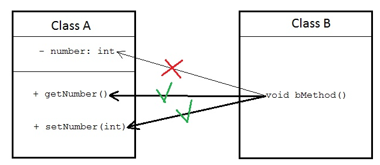


## 重载 - Overloading 

Overloading is when two or more methods in the same class have the same method name. To be valid, any two definitions of the method name must have different signatures. 

A signature consists of the name of a method together with its parameter list

```java
// method takes one parameter of type Date
public void setDate(Date date) {}

// method takes 3 parameters
public void setDate(int day, int month, int year) {}

// method takes 3 parameters of different types
public void setDate(int day, String month, int year) {}
```

条件：Differing signatures must have different numbers and/or types of parameters.

The signature of a method only includes the method name and its parameter types. The signature does not include the type returned. Java does not permit methods with the same name and different return types **<u>in the same class.</u>**


##  构造器 - Constructors

designed to initialize the instance variables for an object. 

```java
public class Date {
    private int day;
    private int month;
    private int year;

    // constructor
    public Date(int day, int month, int year) {
        setDay(day);
        setMonth(month);
        setYear(year);
    }

    // copy constructor
    public Date(Date date) {
        day = date.day;
        month = date.month;
        year = date.year;
    }

    // accessor methods
    public int getDay() {
        return day;
    }

    public int getMonth() {
        return month;
    }

    public int getYear() {
        return year;
    }

    // mutator methods with test of incoming data
    public void setDay(int day) {
        if((day <= 0) || (day > 31)) {
            System.out.println("Fatal Error");
            System.exit(0);
        } else {
            this.day = day;
        }
    }

    public void setMonth(int monthNumber) {
        if((monthNumber <= 0) || (monthNumber > 12)) {
            System.out.println("Fatal Error");
            System.exit(0);
        } else {
            month = monthNumber;
        }
    }

    public void setYear(int year) {
        if((year < 1000) || (year > 9999)) {
            System.out.println("Fatal Error");
            System.exit(0);
        } else {
            this.year = year;
        }
    }
    
    public boolean equals(Date otherDate) {
        if((otherDate.day == day)
            && (otherDate.month == month)
            && (otherDate.year == year)) {
                return true;
            } else {
                return false;
            }
    }

    public static void main(String[] args) {
        Date date1 = new Date(1, 2, 2021);
        Date date2 = new Date(date1);
        date2.setMonth(5);

        System.out.println(date1.equals(date2));
    }
}
```

The first action taken by a constructor is to create an object with instance variables. It is, therefore, legal to invoke another method within the definition of a constructor, since it has the newly created object as its calling object. For example, mutator methods can be used to set the values of the instance variables inside the constructor. It is even possible for one constructor to invoke another.

构造函数的第一个动作是用实例变量创建一个对象。因此，在构造函数的定义中调用另一个方法是合法的，因为它将新创建的对象作为其调用对象。例如，可以使用突变器方法来设置构造函数内部的实例变量的值。甚至可以让一个构造函数调用另一个构造函数。

A constructor that takes an object of the same class as a parameter to create a copy of it is often referred to as a `copy constructor`.

一个以同一类别的对象作为参数来创建其副本的构造函数通常被称为复制构造函数。

Like any ordinary method, every constructor has a *this* parameter. The *this* parameter can be used explicitly but is more often understood to be there than written down. The first action taken by a constructor is to automatically create an object with instance variables. Then within the definition of a constructor, the *this* parameter refers to the object created by the constructor.

像任何普通方法一样，每个构造函数都有一个this参数。this参数可以明确地使用，但更多的时候是理解为存在于那里而不是写下来。构造函数所做的第一个动作是自动创建一个带有实例变量的对象。然后在构造函数的定义中，this参数是指由构造函数创建的对象。

If you do not include any constructors in your class, Java will automatically create a **default** or **no-argument** **constructor** that takes no arguments, performs no initializations, but allows the object to be created. If you include one or more constructors in your class, Java will not provide this default constructor. If you include constructors in your class, it is good practice to always provide your own no-argument constructor. 

如果你在类中不包含任何构造函数，Java会自动创建一个默认的或无参数的构造函数，它不需要参数，不执行初始化，但允许创建对象。如果你在你的类中包含一个或多个构造函数，Java将不提供这个默认的构造函数。如果你在你的类中包含构造函数，最好的做法是总是提供你自己的无参数构造函数。


````{admonition} Quiz9 - Person

Write a Java class called *Person* that has three instance variables:

- a name (String)
- an age (int)
- a gender (String)

Additionally, implement a constructor that initializes these instance variables when called as follows:

```
Person person = new Person("Joe", 25, "male");
```

Make sure that a person's age is never < 0. The default value for *age* should be set to 0, the name to "anonymous", and the gender to "unknown" if any invalid arguments are provided.

For each instance variable, make sure to provide the following accessor methods:

```java
public String getName() {...} 
public int getAge() {...} 
public String getGender() {...}
```

Don't forget the *setter* methods:

```java
public void setName(String name) {...} 
public void setAge(int age) {...} 
public void setGender(String gender) {...}
```

Add a *toString()* method that returns the value of the instance variables as follows:

```java
Joe (25 years old), gender: male
```

Also, add an *equals()* method that takes another *Person* object as a parameter and returns *true* if all instance variable values are equal.

```java
public boolean equals(Person anotherPerson) {}
```

The *Program.java* file contains the program entry (*i.e.,* the main method). You should not modify it. Instead, you need to modify your *Person.java* class in order to make the program run correctly.

Program.java文件包含了程序条目（即主方法）。你不应该修改它。相反，你需要修改你的Person.java类，以便使程序正常运行。

```JAVA
public class Person 
{
	// TODO: your code goes here
    private String Name;
	private int Age;
	private String Gender;

	// public Person(String Name, int Age, String Gender){
	// 	this.Name = Name;
	// 	this.Age = Age;
	// 	this.Gender = Gender;
	// } 
	public String getName() {
		return Name;
	}
	public int getAge() {
		return Age;
	}
	public String getGender() {
		return Gender;
	}	
	
	public void setPerson(String Name, int Age, String Gender){
		this.Name = Name;
		this.Age = Age;
		this.Gender = Gender;
	} 

	public Person(String Name, int Age, String Gender) {
		if(Name.equals(""))
			this.Name = "anonymous";
		else
			this.Name = Name;
		
		if(Age<0)
			this.Age = 0;
		else
			this.Age = Age;
		
		if(Gender.equals(""))
			this.Gender = "unknown";
		else
			this.Gender = Gender;
	}	

	// public void setName(String name) {
    //     if(name) {
    //         System.out.println("Fatal Error");
    //         System.exit(0);
    //     } else {
    //         this.name = name;
    //     }		
	// }
	// public void setAge(int age) {
    //     if((age < 1000) || (age > 9999)) {
    //         System.out.println("Fatal Error");
    //         System.exit(0);
    //     } else {
    //         this.year = year;
    //     }
		
	// }
	// public void setGender(String gender) {
		
	// }

    public String toString() { //the toString() method does not take parameters and returns a String that describes the current object
        return (Name + " (" + Age + " years old), gender: " + Gender);
    }

    public boolean equals(Person otherPerson) {
        if((otherPerson.Name == Name)
            && (otherPerson.Age == Age)
            && (otherPerson.Gender == Gender)) {
                return true;
            } else {
                return false;
            }
    }
}
```

```JAVA
public class Program {

	/**
		Program entry:
		You should not change the code in here but rather adjust Person.java to make the code below work
	**/
	public static void main (String[] args) 
	{
		Person person1, person2;
		person1 = new Person("Joe", 25, "male");
		person2 = new Person("Anna", 35, "female");

		
		assert(person1.toString().equals("Joe (25 years old), gender: male"));
		assert(!person1.equals(person2));
    
		// test1: invalid name
        Person person = new Person("", 55, "male");
        assert(person.toString().equals("anonymous (55 years old), gender: male"));

		// test2: invalid age
        person = new Person("Marta", -12, "female");
        assert(person.toString().equals("Marta (0 years old), gender: female"));
    
    	// test3: invalid gender
		person = new Person("Finnigan", 1, "");
        assert(person.toString().equals("Finnigan (1 years old), gender: unknown"));

		System.out.println("If you see this: no errors found :)");
    }
}
```
````


````{admonition} Quiz10 - Histogram of Temperatures

A group of [Meteorologists](https://en.wikipedia.org/wiki/Meteorology) are looking for a simple tool to help them plot temperatures as a quick and simple way of visualizing their data for a study they are performing on temperatures at particular locations across the span of the five workdays during the week.

Write a program that reads in temperatures (in Celsius) for the five weekdays, that is, from Monday to Friday and plots a histogram showing the temperatures.

Use a **static method** to help you simplify your code.

Below is a sample run of the program:

```java
$ javac Temperatures.java
$ java Temperatures
Please enter temperature for Monday: 25
Please enter temperature for Tuesday: 33
Please enter temperature for Wednesday: 26
Please enter temperature for Thursday: 28
Please enter temperature for Friday: 20

Histogram of Temperatures
--------------------------
Mon | *************************
Tue | *********************************
Wed | **************************
Thu | ****************************
Fri | ********************
```


A sample test input file named **"test_input.txt"** has also been provided with the program scaffold code.

Run the program using `input redirection` as follows:

```java
$ java Temperatures < test_input.txt
```

You can also capture the output of your program using output redirection. Running the following will save the output into the file **"my_output.txt"**:

```java
$ java Temperatures < test_input.txt > my_output.txt
```

A sample expected output file named **"test_output.txt"** has also been provided. To automatically test for differences between your program's output and the expected output, you can now run:

```java
$ diff my_output.txt test_output.txt
```

If the diff command prints no output, then there are no differences in the two output files, and your program is creating the expected output, for the given input. If there are differences, then diff will print out the line differences.

`Note: This is effectively how many of the test cases on edstem have been configured to run for the worksheets. When working on your own projects, creating test cases - that is - a set of input and output pairs, can be a good way to test your program for correctness.`

Alternatively, you can also use the `sdiff` tool to show you your output compared to the expected output, side-by-side. The file you provided in the first argument to sdiff will appear on the left, and the second file will appear on the right.

```java
$ sdiff my_output.txt test_output.txt
```


// 官方答案

```java
import java.util.Scanner;

public class Temperatures {
	
	public static void main(String[] args) {

		Scanner scanner = new Scanner(System.in);
		
		// Read in the temperature input from the user.
		System.out.print("Please enter temperature for Monday: ");
		int temperatureMonday = scanner.nextInt();
		
		System.out.print("Please enter temperature for Tuesday: ");
		int temperatureTuesday = scanner.nextInt();
		
		System.out.print("Please enter temperature for Wednesday: ");
		int temperatureWednesday = scanner.nextInt();
		
		System.out.print("Please enter temperature for Thursday: ");
		int temperatureThursday = scanner.nextInt();
		
		System.out.print("Please enter temperature for Friday: ");
		int temperatureFriday = scanner.nextInt();
		
		// Print out our graph.
		System.out.println();
		System.out.println("Histogram of Temperatures");
		System.out.println("--------------------------");
		renderGraphBar("Mon", temperatureMonday);
		renderGraphBar("Tue", temperatureTuesday);
		renderGraphBar("Wed", temperatureWednesday);
		renderGraphBar("Thu", temperatureThursday);
		renderGraphBar("Fri", temperatureFriday);
		
		scanner.close();
		
	}
	
	/**
	 * Generates a single graph bar.
	 * @param label            the label to be displayed for the graph
	 * @param numberOfSegments the number of segments to print for the bar
	 */
	private static void renderGraphBar(String label, int numberOfSegments){
		
		// Print out the label.
		System.out.print(label + " | ");
		
		// Print out the graph bar.
		for(int i = 0; i < numberOfSegments; i++) {
			System.out.print("*");
		}
		
		System.out.println();
	}

}

```
````


````{admonition} Quiz11 - Traffic Infringements

The traffic section of a Police Department wishes to automate the writing of warnings, fines etc. to motorists who exceed the 60km/hr speed limit and whether doing it under influence of liquor or not. Your task is to implement the following warning and fines in the program based on the corresponding conditions: 

```java
Condition:                 Message(s):

> 60 and < 65              Warning

> 60 and < 65 and drunk    Warning + Take a shower

65 to <= 70                $5.0 fine for each km/hr over 60 km/hr

65 to <= 70 and drunk      $7.0 fine for each km/hr over 60 km/hr + Take a shower

> 70                       $10.0 fine for each km/hr over 60 km/hr

> 70 and drunk             $15.0 fine for each km/hr over 60 km/hr
                           Spend the day/night in cell until become sober
```

The program should ask the traffic officer to type in the km/hr speed of the offending driver. It should then ask whether driver is drunk or not. (The officer answers with a ‘Y’ or ‘N’ and the appropriate message is then given.) The program should then display the appropriate message and where any fine is applicable, the program should compute and display the fine.

1. ```java
   Please enter speed: 64
   Is the driver drunk? ('Y' for drunk, 'N' otherwise): N
   
   ****************************************************
   Warning
   
   ----------------------------------------------------
   You have a fine of $0.0
   ****************************************************
   ```

2. ```java
   Please enter speed: 64
   Is the driver drunk? ('Y' for drunk, 'N' otherwise): Y
   
   ****************************************************
   Warning + Take a shower
   
   ----------------------------------------------------
   You have a fine of $0.0
   ****************************************************
   ```

3. ```java
   Please enter speed: 85
   Is the driver drunk? ('Y' for drunk, 'N' otherwise): Y
   
   ****************************************************
   $15.0 fine for each km/hr over 60 km/hr
   
   Spend the day/night in cell until become sober.
   
   ----------------------------------------------------
   You have a fine of $375.0
   ****************************************************
   ```


// output

```java
import java.util.Scanner;

public class TrafficInfringement {
	
	// Some constants for the different speed limit and fine ranges.
	private static final int SPEED_LIMIT = 60;
	private static final int SPEED_WARN_RANGE_LOW = 60;
	private static final int SPEED_WARN_RANGE_HIGH = 65;
	private static final int SPEED_MINOR_FINE_RANGE_LOW = 65;
	private static final int SPEED_MINOR_FINE_RANGE_HIGH = 70;
	private static final int SPEED_MAJOR_FINE_RANGE_LOW = 70;
	
	private static final double FINE_RATE_MINOR_SOBER = 5.0;
	private static final double FINE_RATE_MINOR_DRUNK = 7.0;
	private static final double FINE_RATE_MAJOR_SOBER = 10.0;
	private static final double FINE_RATE_MAJOR_DRUNK = 15.0;
	
	
	public static void main(String[] args){
		
		Scanner scanner = new Scanner(System.in);

		// Read in the speed and status of the driver.
		System.out.print("Please enter speed: ");		
        double speed = scanner.nextDouble();
		
		System.out.print("Is the driver drunk? ('Y' for drunk, 'N' otherwise): ");
        boolean isDrunk = scanner.next().equalsIgnoreCase("Y");
        
        // Set some defaults for the fine and output message.
        double fine = 0.0;
        String message = "";
		
        // Check speed limit ranges and status of driver to determine message and fine to print.
        if(speed > SPEED_WARN_RANGE_LOW && speed < SPEED_WARN_RANGE_HIGH) {
        	
        	if(!isDrunk) {
        		message = "Warning";
        	} else {
        		message = "Warning + Take a shower";
        	}
				
		} else if (speed > SPEED_MINOR_FINE_RANGE_LOW && speed <= SPEED_MINOR_FINE_RANGE_HIGH){
			
			if(!isDrunk) {
				message = "$" + FINE_RATE_MINOR_SOBER + " fine for each km/hr over " + SPEED_LIMIT + " km/hr";
				fine = (speed - SPEED_LIMIT) * FINE_RATE_MINOR_SOBER;
        	} else {
        		message = "$" + FINE_RATE_MINOR_DRUNK + " fine for each km/hr over " + SPEED_LIMIT + " km/hr";
    			fine = (speed - SPEED_LIMIT) * FINE_RATE_MINOR_DRUNK;
        	}
			
		} else if (speed > SPEED_MAJOR_FINE_RANGE_LOW){
			
			if(!isDrunk) {
				message = "$" + FINE_RATE_MAJOR_SOBER + " fine for each km/hr over " + SPEED_LIMIT + " km/hr";
				fine = (speed - SPEED_LIMIT) * FINE_RATE_MAJOR_SOBER;
			} else {
				message = "$" + FINE_RATE_MAJOR_DRUNK + " fine for each km/hr over " + SPEED_LIMIT + " km/hr" + 
						  "\n\nSpend the day/night in cell until become sober.";
				fine = (speed - SPEED_LIMIT) * FINE_RATE_MAJOR_DRUNK;
			}
			
		} else {
			
			message = "All good!";
			
		}
        
        // Print out the fine.
        System.out.println();
		System.out.println("****************************************************");
		System.out.println(message);
		System.out.println();
		System.out.println("----------------------------------------------------");
		System.out.println("You have a fine of $" + fine);
		System.out.println("****************************************************");
		
		scanner.close();

	}
}
```
````


# 面对对象一件套 - Object Oriented Programming, Objects, Classes

## 创建类 - Creating Class

```java
public class Dog {

    // Some instance variables.
    private String name;
    private int age;

    // A constructor.
    public Dog(String name, int age) {
        this.name = name;
        this.age = age;
    }

    // A method.
    public void greet() {
        System.out.println("Woof! My name is " + name + " and I'm " + age + " years old!");
    }
}
```

// The Dog class has the **instance variables**, **name** and **age**, which hold specific information about the dog.


## 创建方法 - Creating Methods

- Methods can be thought of actions that can be run on classes and objects. Methods can take zero or more arguments as input, and can return either a single result, or no result at all.

  方法可以被认为是可以在类和对象上运行的动作。方法可以接受零个或多个参数作为输入，并且可以返回一个单一的结果，或者根本就没有结果。

- There are two kinds of methods - **static** methods and **non-static** methods.

  有两种方法：**静态**方法和**非静态**方法。

- Static methods belong to the class itself, and are similar to functions in other programming languages like C and Python.

  静态方法属于类本身，类似于C和Python等其他编程语言中的函数。

- In Object Oriented Programming, we will mostly use non-static methods as a way of implementing "actions" on individual objects. There are some cases where use of a static method makes sense, but this can be quite rare, so it's worth considering twice whether or not a non-static method would be more suitable.

  在面向对象编程中，我们大多会使用非静态方法作为对单个对象实现 "动作 "的方式。在某些情况下，使用静态方法是有意义的，但这种情况可能相当罕见，所以值得反复考虑是否非静态方法会更合适。

- Methods can take in **parameters**, that you specify as a parameter list. Methods can also **return** a result, the type of which is defined by the type before the method name.

  ```java
  public int add(int num1, int num2) {
      return num1 + num2;
  }
  ```

  如果不想return

  ```java
  public void printSum(int num1, int num2) {
      System.out.println(num1 + num2);
  }
  ```


## 注意事项 - Caution

**Syntax**

- Class names should match the name of the file they are defined in. The means if you have a class called Dog, the file name that it is in should be named Dog.java.

**Convention**

- **Class names** should be written using `UpperCamelCase`, that is, they should start with a capital letter and use capital letters to separate the border of words. Java uses this as a convention so that it's easy to distinguish class names from variable name and method names in your program (**variable names** and **method names** should use **lowerCamelCase**, that is, to start with a lowercase letter and use capital letters to separate the border of words).

  **类名**应使用 "UpperCamelCase "来书写，也就是说，它们应该以大写字母开始，并使用大写字母来分隔单词的边界。Java将此作为惯例，以便在程序中容易区分类名和变量名及方法名（**变量名**和**方法名**应使用**lowerCamelCase**，即以小写字母开头，用大写字母分隔单词的边界）。

**Class Design: Information Hiding**

- Instance variables and methods have a **visibility modifier (public, private, protected)**, which controls whether these variables and methods can be accessed from outside of the class.

  - Variables and methods that should be hidden from the outside should be made private. This prevents those variables and methods from being accessed / called from outside of the class.

    应该从外部隐藏的变量和方法应该被定为私有。这可以防止这些变量和方法被从类的外部访问/调用。

  - Variables and methods that are only used within a class should be made private, since they never need to be accessed directly from outside.

    只在类内使用的变量和方法应该被设置为私有，因为它们从来不需要从外部直接访问。

  - Generally instance variables should be all be made private, and their access and modification should be controlled by the existence or absence of getter and setter methods. (eg if you don't want a variable to change from outside the class, then make it private and restrict modifications to it by not creating a setter method; if you want a variable to be visible from outside the class, then create a getter method for it).

    一般来说，实例变量都应该是私有的，它们的访问和修改应该由getter和setter方法的存在或不存在来控制。(例如，如果你不希望一个变量从类外改变，那么就把它变成私有的，并通过不创建setter方法来限制对它的修改；如果你希望一个变量从类外可见，那么就为它创建一个getter方法）。)

  - Methods that you want other classes to call, should be made public.

    你想让其他类调用的方法，应该被公开。

  - Methods that are only used for calculating something used internal to the class should be made private, so as not to clutter up the API of (ie the methods available on) your class.

    那些只用于计算类内部使用的方法应该是私有的，这样就不会使你的类的API（即可用的方法）变得混乱。

**Program Structure**

- One common question, when thinking about the design of a system is, in which class should a method or instance variable be placed? One way of helping to decide, is to think about the **responsibility** of the class, based on its class name. For example, we would expect a class named Dog to have variables such as the name and age of the dog. We would not expect that a dog object should have the name and age of the owner in it as well - the name and age of the owner should go in a different class, perhaps one  named Person. 


````{admonition} Quiz12 - Ocean Drones

A new startup has been developing ocean cleaning drones, called FLOAT-E, that can clean the surface of a body of water to remove plastic waste. They have made some prototypes that demonstrate their proof of concept, but are still trying to determine the best kind of configuration for their drones for ocean cleanups.

FLOAT-E drones each have a configurable battery, and a configurable number of filters, and will be used in bodies of water of various sizes.

The startup has approached you to help them develop a system that can help simulate the configurable drones, and test them on cleaning different bodies of water.

Create a program called DroneSimulation which will allow the company to test different configurations of drones.


The program should allow a user to enter in values for configuring the drone and the body of water that it should clean.

After entering the input, the program should print out the configuration that was read in, and then start simulating the cleaning of the body of water.

While the water is being cleaned, the battery level and plastic remaining in the body of water should be displayed each step of the clean.

Once the drone is either low on battery, or the body of water is considered clean, the cleaning stops and a final status output is printed, displaying the number of steps taken, and the reason for the clean terminating.

E1:

```markdown
Battery size (units): 20
Number of filters: 6
Water body size (units): 100
Plastic (%): 67

Clean initiated for a drone with 6 filters, and battery with charge of 20.0 units.
Water body has a surface size of 100.0 units.

Battery: 100.0% | Plastic: 0.670
Battery: 94.0% | Plastic: 0.602
Battery: 88.0% | Plastic: 0.537
Battery: 82.0% | Plastic: 0.476
Battery: 76.0% | Plastic: 0.419
Battery: 70.0% | Plastic: 0.365
Battery: 64.0% | Plastic: 0.315
Battery: 58.0% | Plastic: 0.267
Battery: 52.0% | Plastic: 0.222
Battery: 46.0% | Plastic: 0.180
Battery: 40.0% | Plastic: 0.140
Battery: 34.0% | Plastic: 0.103
Battery: 28.0% | Plastic: 0.067
Battery: 22.0% | Plastic: 0.034

Cleaning stopped after 13 steps.
Reason: Cleaning complete.
```


E2:

```
Battery size (units): 10
Number of filters: 3
Water body size (units): 1000
Plastic (%): 50

Clean initiated for a drone with 3 filters, and battery with charge of 10.0 units.
Water body has a surface size of 1000.0 units.

Battery: 100.0% | Plastic: 0.500
Battery: 94.0% | Plastic: 0.497
Battery: 88.0% | Plastic: 0.494
Battery: 82.0% | Plastic: 0.491
Battery: 76.0% | Plastic: 0.488
Battery: 70.0% | Plastic: 0.485
Battery: 64.0% | Plastic: 0.482
Battery: 58.0% | Plastic: 0.479
Battery: 52.0% | Plastic: 0.476
Battery: 46.0% | Plastic: 0.473
Battery: 40.0% | Plastic: 0.470
Battery: 34.0% | Plastic: 0.468
Battery: 28.0% | Plastic: 0.465
Battery: 22.0% | Plastic: 0.462
Battery: 16.0% | Plastic: 0.459
Battery: 10.0% | Plastic: 0.456
Battery: 4.0% | Plastic: 0.453

Cleaning stopped after 16 steps.
Reason: Battery was low.
```

`The String.format() method may be useful for you here, for formatting the output to a set number of decimal places.`

`For example, String.format("%.2f", 1.234567) will format the number to **2 decimal places**, creating the string "1.23".`


Your program should contain the following classes:

- The **DroneSimulation** class, which contains the main method of the program and manages the overall handling of input and the running of the simulation.
- The **Drone** class, which represents an individual FLOAT-E drone.
- The **Battery** class, which represents a battery, which can be configured and used for the drone.
- The **WaterBody** class, which represents the body of water that the drone should act on, to clean it.

Some basic starter code for these classes have been created for you to use as a starting point. Some of these classes will have partially implemented methods for you to complete. 


Task 1: Create instance variables and constructors

Create the **instance variables** required in each of the Drone, Battery and WaterBody classes, related **getters** and **setters**, as well as appropriate **constructors** for initializing these instance variables. Note that the exact name of the instance variables are up to you.

**Drones** should have a configurable battery, and a configurable number of filters.

**Batteries** have a maximum battery charge and a current battery charge (measured in "units").

**WaterBodies** have a surface size (measured in "units"), and a plastic surface size, which is the amount of the water surface covered in plastic (also measured in "units").


Task 2: Create the methods

Implement and complete the methods for each of the Drone, Battery and WaterBody classes. Some method stubs have been provided to you in the starter code, with their method descriptions below, but you may create additional methods in your code if you chose. 

The **WaterBody** should have a **clean()** method that takes no arguments, but when called, should reduce the amount of surface plastic by:


The **Battery** should have a method called **drain()** which takes as an argument **the number of filters** on the drone. Each call to the drain() method should decrease the battery's current charge by:


The **Drone** should have a **clean()** method, which takes a **WaterBody** as an argument. When this method is run, the drone should keep taking steps to clean the body of water while the drone has enough battery, and the water body is not yet clean.

**Each** **step** of the cleaning process should reduce the battery by calling the **drain()** method on the battery. Each step, the **clean()** method on the water body should be called once for every filter on the drone, as well.

**Cleaning should stop if the battery is low** (ie has less than 5% of the total charge remaining) or **when the water body is considered clean** (ie there is less than 0.05 plastic left in the water).

 Task 3: Complete the main method

Finally, implement the remainder of the **main()** method in **DroneSimulation**, to tie the program together.

 标答：


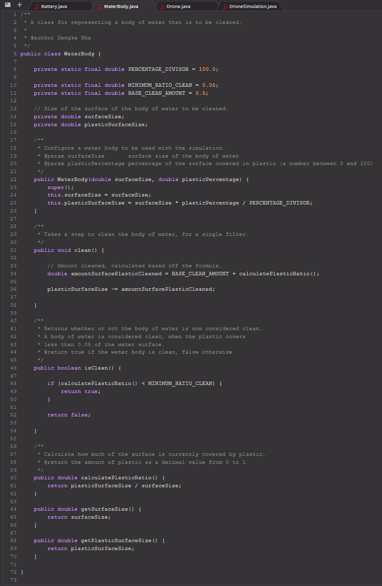


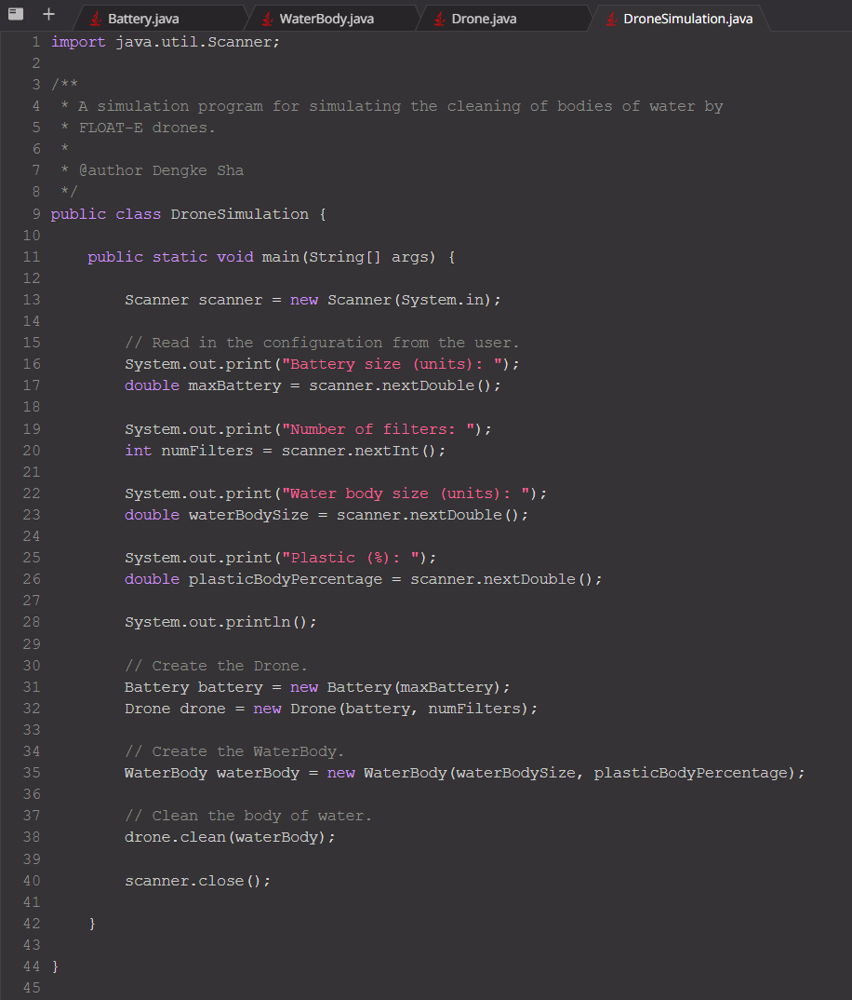


 我的答案：

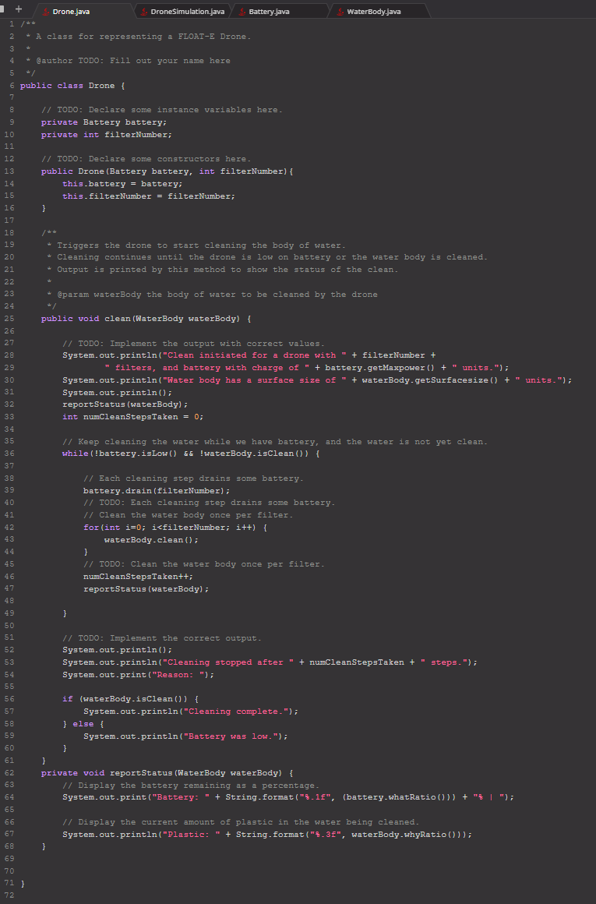

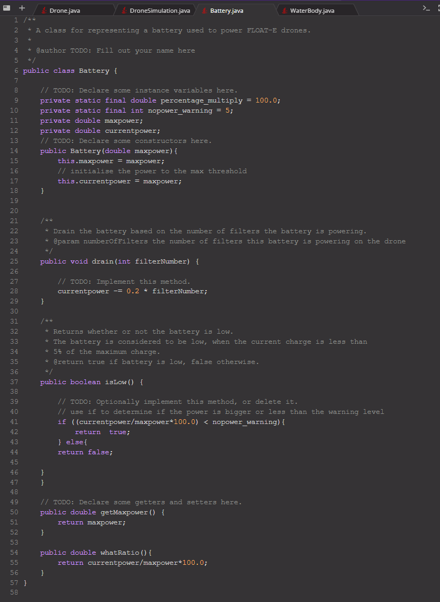

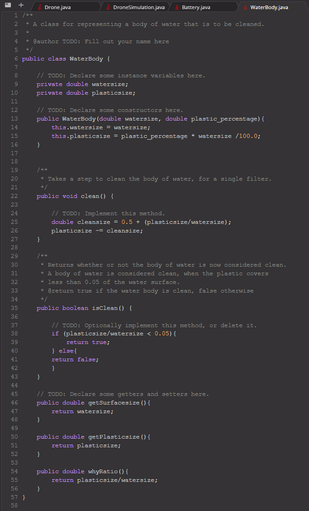

````

###  

### 静态方法 - Static Methods

- A *static method* is one that can be used without a calling object

  一个*静态方法*是一个可以在没有调用对象的情况下使用的方法。

- A static method still belongs to a class, and its definition is given inside the class definition

  一个静态方法仍然属于一个类，它的定义是在类的定义中给出的。

```java
public static returnedType myMethod(parameters) { . . . }
```

Static methods are invoked using the class name in place of a `calling object`

```java
returnedValue = MyClass.myMethod(arguments);
```

- cannot call non-static methods

  - When a *non-static* method is called, it is passed a hidden parameter, `this`, which refers to the object ("instance") of this class from which it is being called.  A static method can be called without an object, like  `Main.main()`,  and so there is no `this` variable that it can pass.

    Fix the above code in one or both of the following ways:

    1. Make `sayHello()` static too.
    2. In `main()`, create a new variable called  `instance` of class `Main`, and then call  `Main.sayHello()`


###  静态变量 - Static Variables

- There is only one copy of a static variable per class.
- There is a separate copy of an instance variable for each object of the class
- All objects of the class can read and modify a static variable
- 常数可以不被private，The exception is **constants**.  These are variables declared with the `final` modifier, which means that they cannot  be changed.  This makes it safe to make them `public`. ---》 被引用时候`int year = RoundStuff.PI;`

Although a static method cannot access and instance variable, it can access a static variable.

A static variable is declared like an instance variable, with the addition of the modifier `static`   `private static int myStaticVariable;`


```java
public class Main {
    public static void main (String[] args) {
        for (int i = 0; i < 10; i++) {
            Human newHuman = new Human ("Person " + i);
            System.out.println("Current population: "
                + Human.getPopulation());
        }
    }
}

class Human {
    private String name;
    private static int populationCount = 0;

    public Human(String aName) {
        name = aName;
        populationCount++;
    }

    public static int getPopulation() {
        return populationCount;
    }
}

//output
Current population: 1
Current population: 2
Current population: 3
Current population: 4
Current population: 5
Current population: 6
Current population: 7
Current population: 8
Current population: 9
Current population: 10
```


````{admonition} Quiz13 - Share price

This exercise is to create a class `Holding` that  represents a single investment on the share market.  A `Holding` object records how many shares a person holds in a particular stock.

The class Holding also records the current value of each share.  This is common to all `Holding` objects.

Use your knowledge of static methods and static variables to create this class.

A test class SharePrice has been written, which indicates what methods are required.  It should be called from the console (  >_  )  as

```java
java  SharePrice  sharesInAccount1  sharesInAccout2  pricePerShare
```

===

```java
java   SharePrice  11   87   43.6
```

```java
class SharePrice {
    static public void main (String[] args) {
        Holding account1 = new Holding(Double.parseDouble(args[0]));
        Holding account2 = new Holding(Double.parseDouble(args[1]));

        Holding.setPrice (Double.parseDouble(args[2]));

        System.out.println("Account 1 is worth " + account1.value());
        System.out.println("Account 2 is worth " + account2.value());
    }
}
```


- 错误代码

```java
class Holding {
    private static double price;
    private static double amount; //因为不同的变量有不同的amount，不能static

    public Holding(double amount1){
        this.amount = amount1; // 传值到instance，对的
    }
    public static void setPrice(double price1){
        Holding.price = price1;
    }
    
    
    
  	// 这里不能用static，原因如下图。
    // 如果为了调用amount把amount改成static则不符合逻辑
    // 如果创建新的object不好赋值
    public static double value(){ 
     	// Holding holding = new Holding(1);
        return price * Holding.amount;
    }
}
```


- 正确代码

```java
class Holding {
    private double amount;
    private static double price;

    public Holding (double amount){
        this.amount = amount;
    }

    public static void setPrice(double price){
        Holding.price = price;
    }

    public double value(){
        return amount * price;
    }
}
```
````


----

# 本章小结

- Static methods:  Can be called without an object.

- Static variables:  Shared by all objects of this class.

- Math Class

  - Math class provides many static methods related to (you guessed it) mathematics.

  - It is in `java.lang` which is imported by default, and so you do not need an `import` statement.

  - **All** of its elements are `static`, and so you will never need to create an object of class `Math`.

  - It has two constants

    - Math.E  (the base of the natural logarithms, = Math.exp(1.0))
    - Math.PI (π=3.14159265...)

    ​        `area = Math.PI * radius * radius;`

- 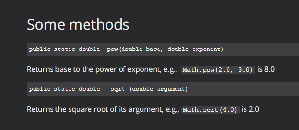

- 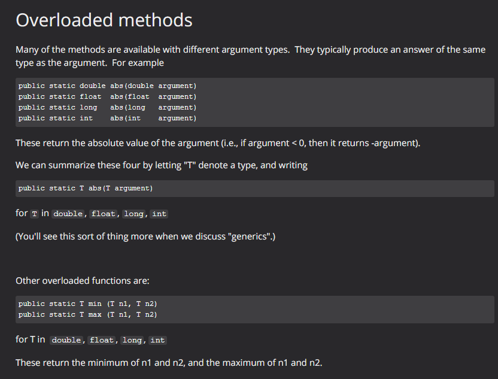

- 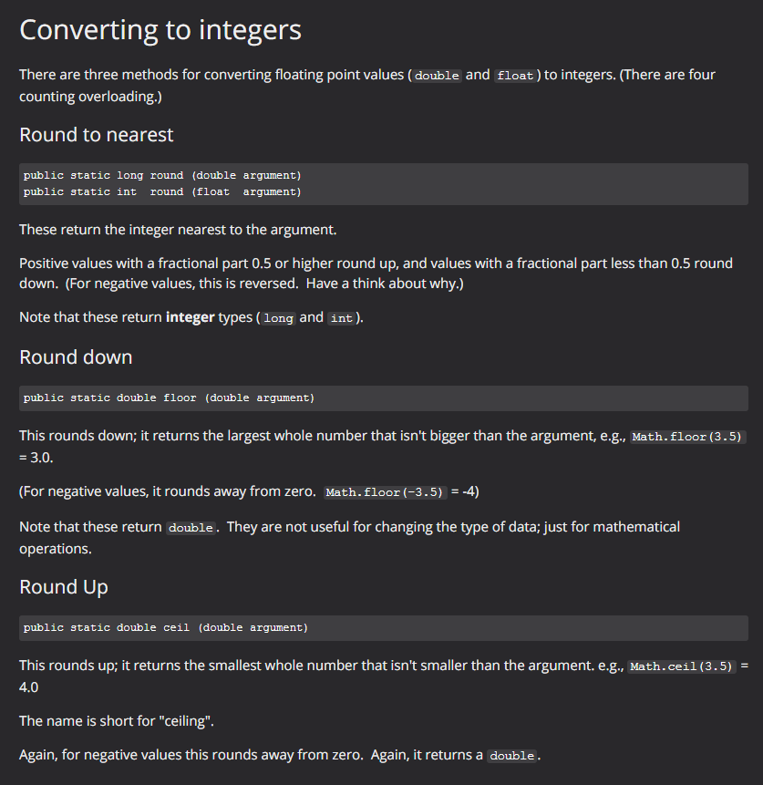

- 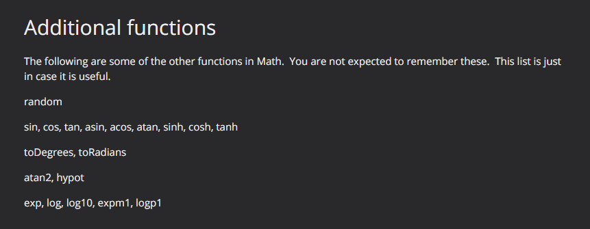


## 封装类 - Wrapper Class

Variables of primitive types are not Java objects.  That is, they are not of a class derived from class Object.

That means we cannot have, for example, a java List of integers, because the List class can only have lists of Object elements.

However, java provides classes that behave like the primitive types:

```markdown
# 类似primitives的类们

boolean -> Boolean
byte    -> Byte
short   -> Short
long    -> Long
float   -> Float
double  -> Double
char -> Character
int  -> Integer
```


## Boxing

The process of going from a value of a primitive type to an object of its wrapper class

- To convert a primitive value to an "equivalent" class type value, create an object of the corresponding wrapper class using the primitive value as an argument

  要将一个基元值转换为一个 "等价 "的类类型值，请使用基元值作为参数创建一个相应封装类的对象

- The new object will contain an instance variable that stores a copy of the primitive value

  新对象将包含一个实例变量，该变量存储了原始值的副本。

- Unlike most other classes, a wrapper class does not have a no-argument constructor

  与大多数其它类不同，包装器类没有无参数构造函数

   `Integer integerObject = new Integer(42);`


## Unboxing

The process of going from an object of a wrapper class to the corresponding value of a
primitive type.  `None of these methods take an argument`

```java
  Boolean.booleanValue()
     Byte.byteValue()
    Short.shortValue()
  Integer.intValue()
    Float.floatValue()
   Double.doubleValue()
Character.charValue()
```


## Automatic boxing and unboxing

```
Integer integerObject = 42;
int i = integerObject;
```


## Static Method - String 转换

```java
Integer.parseInt ()
Long.parseLong ()
Float.parseFloat ()
Double.parseDouble ()
```

`Double.toString(123.99);`    returns the string value "123.99"


## Case sensitive

```java
public static char toUpperCase(char argument)
public static char toLowerCase(char argument)
```

Replace

```java
public static boolean isUpperCase(char argument)
public static boolean isLowerCase(char argument)
```

only return `true` for Roman letters (a-z,A-Z, and accented versions) and Greek letters.  They both return false for characters from alphabets that do not have upper and lower case.


```java
public static boolean isWhitespace(char argument) // Whitespace (space, tab \t, new line \n)
public static boolean isLetter(char argument)     // A letter a-z, A-Z, accented chars
public static boolean isDigit(char argument)
public static boolean isLetterOrDigit(char argument)
```

- `isLetter` returns `true` for unicode letters from other languages, such as Hindi and Chinese.  Combining this with testing for both `isUpperCase` and `isLowerCase` allows you to distinguish between Roman/Greek letters and other scripts.

- `isDigit` returns `true` for characters like ๓ that are only digits but not letters, but not for Chinese digits like '二' that are also classed as "letter", nor for decorated digits like ➀.


E.g. 首字母大写的句子

```java
import java.util.Scanner;

/**
Illustrate the use of a static method from the class Character.
*/

public class StringProcessor {
    public static void main (String[] args) {
        System.out.println("Enter a one-line sentence:");
        Scanner keyboard = new Scanner(System.in);
        String sentence = keyboard.nextLine();
        
		sentence = sentence.toLowerCase();
		char firstCharacter = sentence.charAt(0);
		sentence = Character.toUpperCase(firstCharacter) + sentence.substring(1);

        System.out.println("The revised sentence is:");
        System.out.println(sentence);
    }
}
```


```{admonition} Quiz14 - your own extension to StringProcessor

1. Modify the code to add a "." at the end of the sentence if it ends with a letter or a digit. You can find the length of a string using the length() method.
2. Print "This sentence contains a number" (once only) if any of the characters is a digit.
3. Advanced: Style guides recommend spelling out the integers 0-9. Replace any 1-digit number by the text form of it. For example "1" -> "one", "0"->"zero". But leave two-digit numbers unchanged.

```

 

## 引用 - Reference and class parameters

计算机的两种内存

- Secondary memory (typically a hard disk, or flash drive like SSD) is used to hold files for "permanent" storage
- Main memory (a.k.a. Primary memory, typically RAM) is used by a computer when it is running a program.
  - `Values stored in a program's variables are kept in main memory.`
- "Virtual memory" allows the operating system allows some data from "main memory" to be stored on the hard drive instead of in RAM.  That is the reason we talk about main and secondary memory, instead of hard drive and RAM.  Main memory includes RAM plus virtual memory "swap space".


### Main Memory

Main memory consists of a long list of numbered locations, each of which stores a *byte* (an integer from 0 to 255)

主存储器由一长串编号的位置组成，每个位置存储一个*字节（从0到255的整数）。

A byte contains eight ***b\***inary dig***its\***, called *bits*, that can each be either 0 or 1.

一个字节包含八个***b/***二进制数字****，称为*比特*，每个比特可以是0或1。

Each byte location in memory has an *address*, which is an integer that identifies the location.  On a 64-bit machine, it is typically a 64-bit number.

内存中的每个字节位置都有一个*address*，它是一个整数，用于识别该位置。 在64位机器上，它通常是一个64位数字。

A data item is stored in one or (typically) more of these bytes.

一个数据项被存储在一个或（通常）多个这样的字节中。

The address of the (first) byte of the data item is used to find the data item when it is needed, either to check its value or to write a new one.

数据项的（第一个）字节的地址用于在需要时找到该数据项，以检查其值或写入一个新的数据项。

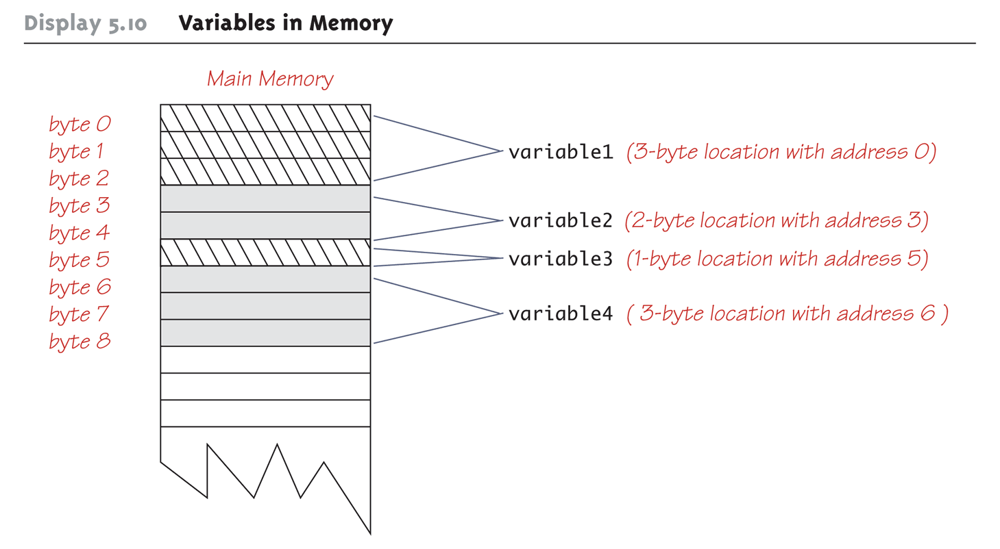


### Conversion

1 Byte = 8 bits

1 kiB = 2^10 = 1024 bytes.  1 kB = 10^3 bytes

1 MiB = 2^20 bytes.  1 MB = 10^6 bytes

1 GiB = 2^30 bytes.  1 GB = 10^9 bytes

2^32B = 4 x 2^30 = 4 GiB

2^64B = 16 x 2^60 ~ 16,000,000,000 GiB.  To paraphrase Bill Gates, that should be enough for anyone.


### Reference

Every variable is stored in a *location* in computer memory.

每个变量都存储在计算机内存的某个位置。

- When the variable is a *primitive* type (int, double etc.), the value of the variable is stored **directly** in the memory location assigned to the variable.  This is possible because each value of a primitive type always requires the same amount of memory to store its values.

  当变量是原始类型（int、double等）时，变量的值直接存储在分配给该变量的内存位置。 这是有可能的，因为原始类型的每个值总是需要相同数量的内存来存储其值。

- When the variable is a *class* type, only the memory address (or ***reference***) of where the object is located is stored at the memory location assigned to the variable.  (Note: two different locations are involved.)

  当变量是一个类类型时，只有对象所在的内存地址（或引用）被存储在分配给变量的内存位置。 (注意：涉及两个不同的位置)。


For classes:

- The object named by the variable is stored in some other location in memory, not the location assigned to the variable.

  由变量命名的对象被存储在内存的其他位置，而不是分配给变量的位置。

- Like primitives, the value of a class variable (i.e., the reference) is a fixed size

  与基元一样，类变量的值（即引用）是一个固定的大小。

- Unlike primitives, the value of a class variable is a memory address or reference

  与基元不同，类变量的值是一个内存地址或引用

- The object whose address is stored in the variable *can be of variable size.*

  其地址被存储在变量中的对象可以是可变大小的。

Because a class variable only holds a reference to the object, two class variables can contain the same reference, and therefor name the **same object**.

因为类变量只持有对对象的引用，所以两个类变量可以包含相同的引用，并因此而命名同一个对象。

The assignment operator sets the reference (memory address) of one class type variable equal to that of another.

赋值运算符将一个类型变量的引用（内存地址）与另一个类型变量的引用相等。

-->  Any change to the object named by one of these variables will produce a change to the object named by the other variable, since they are the same object.

--> 对这些变量之一命名的对象的任何改变都会对另一个变量命名的对象产生改变，因为它们是同一个对象。


 逐值调用 Call - by - Value & 逐一调用 Call - by - Reference

```java
int myFunction (int arg) {
    arg = arg + 1;
    return arg;
}

int a = 1;
int b = myFunction(a);
```

`a 不会受到影响`

In a call-by-reference function call, `arg` would actually stand for `a` during the function call -- `arg` would be a reference to the location where `a` is stored, and so after the function call, `a == 2`.


Technically, all Java methods are call-by-value.  A parameter is a local variable that is set equal to the value of its argument.  Therefore, any change to the value of the parameter cannot change the value of its argument.

从技术上讲，所有的Java方法都是按值调用的。 一个参数是一个局部变量，它被设置为等于其参数的值。 因此，对参数值的任何改变都不能改变其参数的值。

However, since class variables are actually references to objects, they behave very similarly to call-by-reference parameters.  In particular, the function call can change the value of the **object** that the parameter refers to, even though it cannot change the parameter itself (i.e., can't make it refer to a different object).

然而，由于类变量实际上是对对象的引用，它们的行为与逐值调用参数非常相似。 特别是，函数调用可以改变参数所指向的对象的值，尽管它不能改变参数本身（即不能使它指向不同的对象）。


E.g. 2 - Call - by - reference

```java
class Main {
    int value;
    Main () {
        value = 0;
    }

    static Main tryIncrement1 (Main m) {
        m.value++;
        return m;
    }

    static Main tryIncrement2 (Main m) {
        Main n = new Main ();
        n.value = m.value + 1;
        m = n;
        return m;
    }

    public static void main (String[] arg) {
        Main m = new Main ();
        Main n = new Main ();
        /* Uncomment one of the following lines */

        // n = tryIncrement1 (m);
        // n = tryIncrement2 (m);
        // m = tryIncrement1 (m);
        // m = tryIncrement2 (m);

        System.out.println ("Values are " + m.value + " " + n.value);
    }
}
//output
Values are 0 0
```

The value plugged into a class type parameter is a reference (memory address) 

插在类型参数中的值是一个引用（内存地址）

- Therefore, the parameter becomes another name for the argument

  因此，参数成为参数的另一个名称

- Any change made to the object named by the parameter (i.e., changes made to the values of its instance variables) will be made to the object named by the argument, because they are the same object

  对参数所命名的对象所做的任何改变（即对其实例变量的值所做的改变）都会对参数所命名的对象进行改变，因为它们是同一个对象

- Note that, because it still is a call-by-value parameter, any change made to the class type parameter itself (i.e., its address) will not change its argument (the reference or memory address)

  注意，因为它仍然是一个逐值调用的参数，对类型参数本身（即它的地址）的任何改变都不会改变它的参数（引用或内存地址）。

The *value of the object* named by the argument can be updated but the *argument itself* will not be changed.

由参数命名的对象的值可以被更新，但参数本身不会被改变。


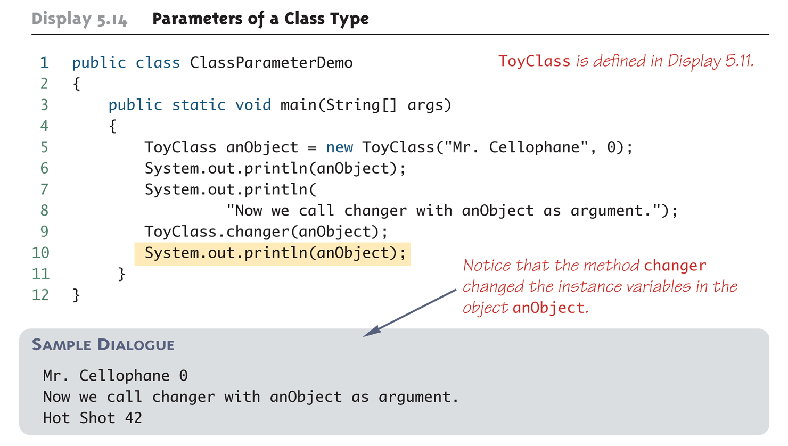

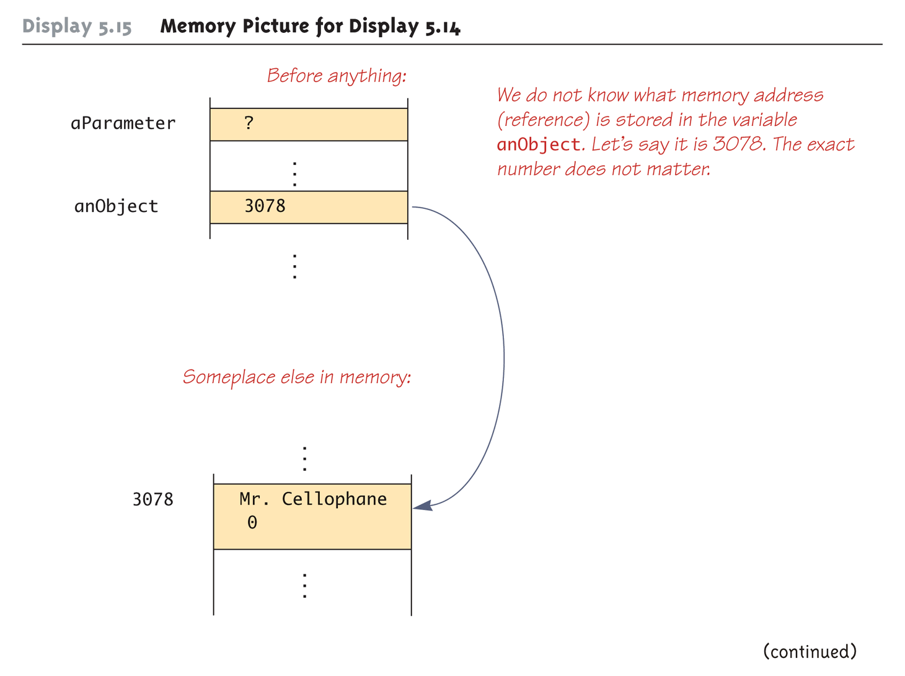

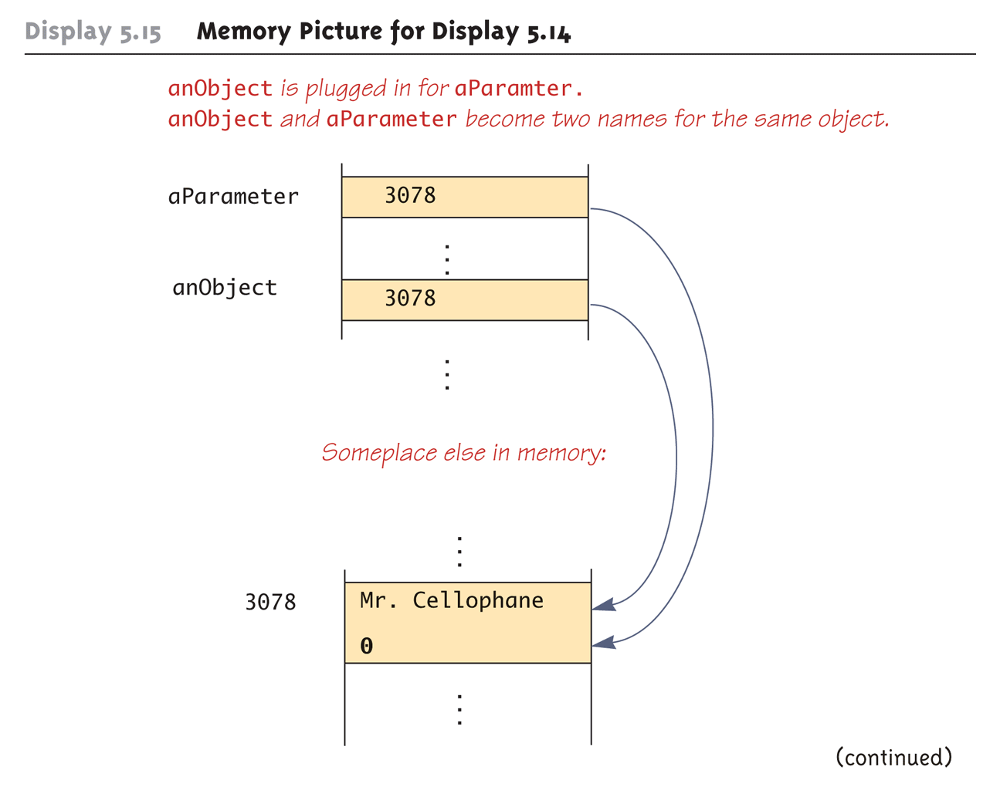

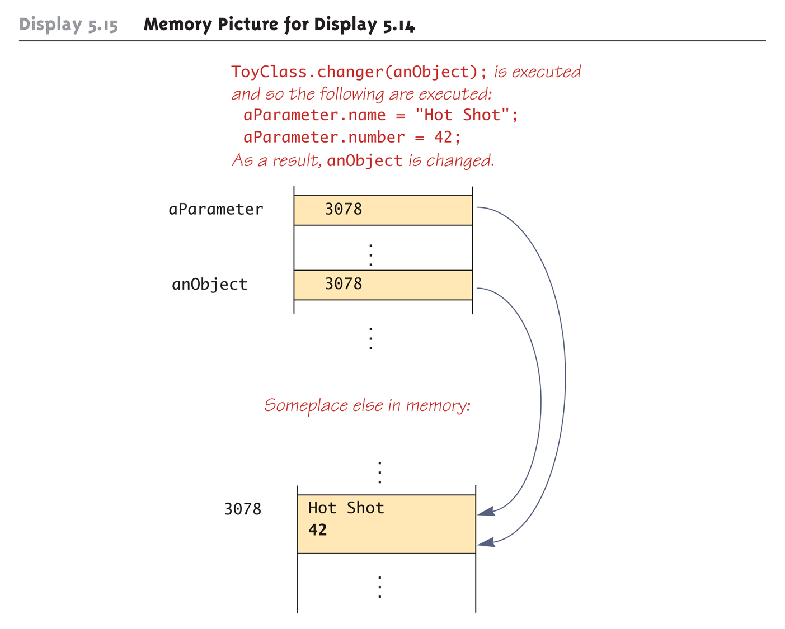


## = and ==

- Assignment (=) causes two variables to be names for the same object; it does not create a copy.
  Changing the instance variables of the object referred to by one variable will cause cause changes in the object referred to by the other  variable, because it is the *same object*.
- Testing for equality (==) only checks that two variables of a class type *refer to the same object*.
  If they refer to two objects with the same instance variables, it will return `false`.
  To test for equality, use the member method `equals()`.


##  空值 - Null

`null` is a special constant that may be assigned to a variable of any class

- e.g., `YourClass  yourObject = null;` 

It indicates that your variable does not currently refer to *any* object at all.

It is often used in constructors to initialize class type instance variables when there is no obvious object to use yet.  If a variable of a class type is not initialized, it will default to being `null`.

`null` is not an object.  It is a placeholder that doesn't refer to anywhere in memory

To test if a variable is `null`, use `==` or `!=` (instead of `equals()` ).  We are testing whether or not the variable refers to something, not testing its value.

- e.g.    `if (myObject == null)`

Because `null` doesn't refer to an object, it is **<u>meaningless to refer to its instance variables.</u>**  Because non-static member functions are allowed to refer to their instance variables, we are also not allowed to call them on a `null` variable.

Accessing a non-static member through a null variable will result in a "Null Pointer Exception" error message.


 运算符和匿名对象 - The new operator and anonymous objects

The `new` operator invokes a constructor which initializes an object, and returns a reference to the location in memory of the object created

- This reference can be assigned to a variable of the object's class type
-  Sometimes the object created is used as an argument to a method, and never used again

- In this case, the object need not be assigned to a variable, i.e., given a name

  

An object whose reference is not assigned to a variable is called an *anonymous object*

```java
    ToyClass variable1 =  new ToyClass(“Joe”, 42);
    if (variable1.equals (new ToyClass(“JOE”, 42)))
```


### Using and misusing references

When writing a program, it is very important to ensure that private instance variables remain truly private

For a `primitive type instance variable`, just adding the `private` modifier to its declaration should insure that there will be no privacy leaks

For a `class type instance variable`, however, adding the `private` modifier alone is not sufficient

----

# 本章小结

In order to exist, a person must have (at least) a name and a birth date.  Therefore, makes sense not to have a no-argument Person class constructor.

两个规则

- A person who is still alive does not yet have a date of death. Therefore, the `Person` class constructor will need to be able to deal with a `null` value for date of death

  没死没有死亡日期

- A person who has died must have had a birth date that preceded his or her date of death. Therefore, when both dates are provided, they will need to be checked for consistency

  死了的话生日日期在前

```java
public Person(String initialName, Date birthDate, Date deathDate)
{
    if (consistent(birthDate, deathDate))
    {
        name = initialName;
        born = new Date(birthDate);
        if (deathDate == null)
            died = null;
        else
            died = new Date(deathDate);
        }
    else
    {
        System.out.println("Inconsistent dates.");
        System.exit(1);
    }
}
```


类不变量 - class invariant

A statement that is always true for every object of the class is called a *class invariant*.  A class invariant can help to define a class in a consistent and organized way.

一个对类的每个对象都是真实的声明被称为类的不变量。 类不变量可以帮助以一种一致和有组织的方式定义一个类

For the `Person` class, the following should always be true: An object of the class `Person` has a date of birth (which is not `null`), and if the object has a date of death, then the date of death is equal to or later than the date of birth

对于人名类来说，以下内容应该永远是真的。Person类的一个对象有一个出生日期（不是空的），如果该对象有一个死亡日期，那么死亡日期等于或晚于出生日期

Checking the `Person` class confirms that this is true of every object created by a constructor, and all the other methods (e.g., the private method `consistent`) preserve the truth of this statement.

检查Person类可以证实，对于每个由构造函数创建的对象来说，这都是真的，所有其他的方法（例如，私有方法一致）都能保持这个声明的真实性

```java
/**
Class invariant: A Person always has a date of birth,
and if the Person has a date of death, then the date of
death is equal to or later than the date of birth.
To be consistent, birthDate must not be null. If there
is no date of death (deathDate == null), that is
consistent with any birthDate. Otherwise, the birthDate
must come before or be equal to the deathDate.
*/
private static boolean consistent(Date birthDate, Date deathDate)
{
    if (birthDate == null) return false;
    else if (deathDate == null) return true;
    else return (birthDate.precedes(deathDate) ||
                 birthDate.equals(deathDate));
}
```


## Methods equals and datesMatch

The definition of `equals` for the class `Person` includes an invocation of `equals` for the class `String`, and an invocation of the method `equals` for the class `Date`

Person类的equals定义包括对String类的equals的调用，以及对Date类的equals方法的调用

Java determines which `equals` method is being invoked from the type of its calling object 

Java通过调用对象的类型来确定哪一个等价方法被调用

Also note that the `died` instance variables are compared using the `datesMatch` method instead of the `equals` method, since their values may be `null` 

还请注意，死亡的实例变量是用datesMatch方法而不是equals方法进行比较的，因为它们的值可能是空的

```java
public boolean equals(Person otherPerson)
{
    if (otherPerson == null)
        return false;
    else
        return (name.equals(otherPerson.name) &&
                born.equals(otherPerson.born) &&
                // datesMatch 用来比较这里的日期
                datesMatch(died, otherPerson.died));
}
```


 datesMatch

```java
/**
To match date1 and date2 must either be the
same date or both be null.
*/
private static boolean datesMatch(Date date1, Date date2)
{
    if (date1 == null)
        return (date2 == null);
    else if (date2 == null) //&& date1 != null
        return false;
    else // both dates are not null.
        return(date1.equals(date2));
}
```


## 复制构造函数 - Copy constructors

A *copy constructor* is a constructor with a single argument of the same type as the class.

The copy constructor should create an object that is a separate, independent object, but with the instance variables set so that it is an exact copy of the argument object.

复制构造函数应该创建一个单独的、独立的对象，但其实例变量的设置使其成为参数对象的精确拷贝。

Note how, in the `Date` copy constructor, the values of all of the **primitive type** private instance variables are merely copied.

请注意，在 Date 复制构造函数中，所有原始类型的私有实例变量的值都只是被复制。

```java
public Date(Date aDate) //constructor - chapter 4
{
    if (aDate == null) //Not a real date.
    {
        System.out.println("Fatal Error.");
        System.exit(0);
    }
    month = aDate.month;
    day = aDate.day;
    year = aDate.year;
}
```

或者 e.g.2 a completely new and independent copy of the original Person object

```
born = original.born //dangerous
died = original.died //dangerous
born = new Date(original.born); //safe
```


## Privacy leaks - 隐私泄露

```java
public Date getBirthDate()
{
    return born; //dangerous
}

public Date getBirthDate()
{
    return new Date(born); //correct
}
```

## 可变与不可变类 - Mutable and immutable classes

但是

```java
public String getName()
{
return name; //Isn't this dangerous?
}
```

Although it appears the same as some of the previous examples, it is not: The class `String` contains no mutator methods that can change any of the data in a String object.

虽然它看起来和前面的一些例子一样，但其实不然。String类不包含可以改变String对象中任何数据的突变器方法。

A class that contains no methods (other than constructors) that change any of the data in an object of the class is called an *immutable class*.

一个不包含可以改变该类对象中任何数据的方法（除了构造函数）的类被称为不可变类。

Objects of such a class are called *immutable objects.*

这种类的对象被称为不可变的对象。

It is perfectly safe to return a reference to an immutable object because the object cannot be changed in any way.

返回对不可变型对象的引用是完全安全的，因为该对象不能以任何方式被改变。

The `String` class is an immutable class.

String类就是一个不可变的类。

A class that contains public mutator methods or other public methods that can change the data in its objects is called a *mutable class*, and its objects are called *mutable objects.*

一个包含公共突变器方法或其他可以改变其对象中数据的公共方法的类被称为可变类，其对象被称为可变对象。

**Never write a method that returns a mutable instance variable.**  Instead, use a copy constructor to return a reference to a completely independent copy of the mutable object

永远不要写一个返回可变实例变量的方法。 相反，使用一个拷贝构造函数来返回一个完全独立的可变型对象的拷贝的引用


## 深度复制与浅度复制 - Deep copy vs Shallow copy

A *deep copy* of an object is a copy that, with one exception, has *no references* in common with the original.  The exception is that references to immutable objects are allowed to be shared.

一个对象的深度拷贝是一个副本，除了一个例外，它与原对象没有共同的引用。 这个例外是，对不可变对象的引用允许被共享。

Any copy that is not a deep copy is called a *shallow copy*. This type of copy can cause dangerous privacy leaks in a program.

任何不是深度拷贝的拷贝被称为浅度拷贝。这种类型的拷贝会导致程序中危险的隐私泄露。

*Advanced*:  If they are used carefully then shallow copies can be more efficient than performing deep copies of large objects.  Best practice is to start making a deep copy, and then once your code is working, you have a thorough test suite and you are optimizing the code, carefully consider using shallow copies in a few limited places for efficiency.

如果谨慎使用，那么浅层拷贝可以比对大型对象进行深度拷贝更有效率。 最好的做法是开始进行深度拷贝，然后一旦你的代码正常工作，你有一个彻底的测试套件，你正在优化代码，仔细考虑在一些有限的地方使用浅层拷贝以提高效率。


